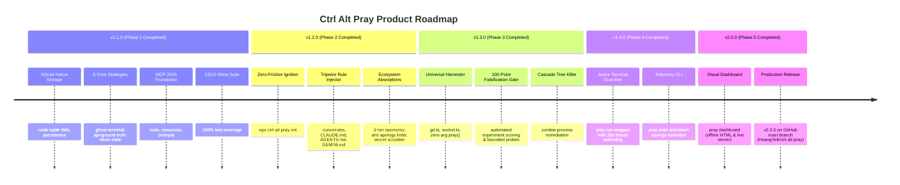

# Ctrl Alt Pray: Product and Implementation Plan

Status: Implemented & Verified (v2.0.0 Production Release). All 5 phases fully built, benchmarked, and verified across 32 Vitest suites with 100% pass rate.

## 1. Product Thesis

**When Ctrl+Z isn't enough.**

Build a local MCP server that helps coding agents escape unproductive loops by maintaining an evidence ledger and returning one discriminating next experiment.

The product is not an AI therapist, another generic brainstorming prompt, or an autonomous code fixer. Its job is to improve the next decision when repeated actions stop producing new information.

Working hypothesis: explicit attempt history, evidence-linked recommendations, and bounded recovery cycles will reduce redundant edits compared with a recovery prompt alone, without reducing task correctness.

Cheapest way to disprove the hypothesis: replay a few stuck debugging sessions against a prompt-only baseline. If the server returns the same generic advice, repeats rejected approaches, or adds ceremony without better next experiments, simplify it before building integrations.

### Success Looks Like

- The agent identifies a falsifiable explanation instead of requesting ten more guesses.
- Each suggested experiment says what observation would change the next action.
- Already-rejected approaches are not recycled without a stated change in evidence or conditions.
- A human receives a question they can answer, not a transcript-sized request to debug everything.
- A fresh agent can resume from a small handoff without repeating known failures.
- Improvement is measured on actual tasks, including regressions and overhead.

### Non-Goals for v0.1

- A dashboard, hosted service, account system, marketplace, or multi-agent swarm.
- Running shell commands, editing repository files, or installing dependencies on the agent's behalf.
- Reading complete conversations, private reasoning traces, or arbitrary workspace files.
- Measuring emotions, making a model breathe, or adding artificial waits.
- Guaranteeing a correct solution or detecting every semantic loop.
- Resetting the host context, changing the model, or overriding user constraints.
- A separate LLM subscription, network-dependent research, or randomized advice.

## 2. Brand and User Experience

Product: **Ctrl Alt Pray**. Repository slug: `ctrl-alt-pray`.

Primary tagline: **When Ctrl+Z isn't enough.**

Supporting lines:

- "Prayers are optional. Evidence is required."
- "Less blind faith. Better experiments."
- "For when your agent has tried everything except a different assumption."

Keep humor in the README, demos, and optional presentation labels. Keep protocol fields, error messages, and diagnostic guidance plain and searchable. A joke must never hide a failure or imply that a test passed.

The two public tools are `pray` and `report_outcome`. Avoid adding a separate tool for every ritual. The underlying recovery logic uses neutral names so integrations can present it without religious language.

Before public release, check name collisions on GitHub and npm and review domain and trademark risks. Local folder creation does not establish availability or rights.

## 3. Why This Should Exist Beyond a Prompt

The essential value is structured state plus disciplined decisions, not a magic phrase.

### A. Evidence Ledger

Record observable outcomes, attempted approaches, relevant state changes, and the checks that support a conclusion. Keep facts, user constraints, and agent hypotheses separate.

Example: "The request returned 401" is an observation. "The token is expired" is a hypothesis. Store the connection, not an unsupported conversion from one to the other.

Every observation carries a source and verification status. A pasted log is agent-reported evidence; the server must not label it independently verified.

### B. Decision-Changing Experiments

Prefer a test whose outcomes distinguish plausible explanations over another patch that merely changes the symptom.

Each recovery card contains a question, a bounded experiment, predicted outcomes, and the next action for each outcome. Do not emit a task-sized checklist masquerading as one step.

### C. Attempt Memory

Remember that an approach failed under particular conditions. Remembering only a command string is insufficient: the same command after a meaningful code change may be exactly the right validation.

### D. Human Unblock Packet

When a necessary constraint or observation is unavailable, output one answerable question and explain which decision depends on it. Do not invent the answer or relax the requirement silently.

### E. Context Handoff

Provide a short, source-linked summary of the problem, constraints, rejected explanations, and pending experiment. The user or host can give it to a fresh conversation. The MCP server cannot start that conversation or clear the old one itself.

## 4. End-to-End Recovery Flow

1. The agent or host notices repeated attempts without decision-changing evidence.
2. The agent calls `pray` with a bounded problem snapshot.
3. The server validates the snapshot and loads only the matching session.
4. The engine separates observed facts from assumptions and identifies the missing distinction.
5. The engine returns exactly one next action: an experiment, a targeted evidence request, or a human question.
6. The agent performs the action using existing tools, permissions, and approval rules.
7. The agent calls `report_outcome`, attaching an observation and a check result when one was run.
8. The engine updates the ledger and chooses to continue, pivot, request help, or stop after the declared success checks are satisfied.

A default activation hint is two attempts on the same explanation with no meaningful change in evidence. This is a configurable workflow hint, not proof that the agent is stuck. Normal red-green testing, flaky-test measurement, and expected polling must not automatically count as a loop.

The server cannot activate itself solely because it is installed. Start with a manual invocation recipe and a clear tool description. Optional host hooks come later and must be capability-checked per client.

## 5. Tool Contracts

These are logical contracts to turn into runtime schemas during implementation. Version the schemas; pin the SDK version only after checking its current stable documentation.

### `pray`

Purpose: start or resume a recovery session and return a compact recovery card.

Input fields:

- `schema_version`: initially `1`.
- `project_key`: an opaque, stable project identifier; never treated as a file path.
- `session_id`: omitted to start a session; required to resume one.
- `expected_revision`: required on a resumed session to prevent stale updates.
- `request_id`: client-generated idempotency key for retrying the same request.
- `problem`: goal, expected behavior, actual behavior, and explicit success criteria.
- `constraints`: non-negotiable requirements and separately marked negotiable preferences.
- `observations`: bounded evidence records with IDs, sources, summaries, and optional check metadata. When relevant, include the observed build/revision, process, environment, input identity, and check purpose (`diagnostic_control` or `acceptance`). Unknown context remains unknown; do not require an exhaustive environment inventory.
- `attempts`: prior approach, hypothesis, test or change, outcome, evidence references, and relevant state changes.
- `candidate_hypotheses`: optional explanations supplied by the caller, with supporting and contradicting evidence references.
- `capabilities`: what the host can currently do, such as run tests, inspect logs, or ask the user.
- `budget`: maximum recovery rounds and optional limits the host can actually measure.

Output fields:

- `session_id`, `revision`, and `schema_version`.
- `assessment`: `insufficient_evidence`, `possible_loop`, `progress`, or `blocked`, with a short rationale and evidence references.
- `known_facts`, `assumptions_to_check`, and `rejected_approaches`: compact summaries, not full transcripts.
- `next_action`: exactly one of `experiment`, `request_evidence`, or `ask_user`.
- `experiment`: present only for an experiment action; includes strategy ID, question, prerequisites, controlled conditions, one probe, observation to collect, expected branches including inconclusive results, risk, permissions needed, cleanup, and stop condition.
- `avoid_repeating`: applicable failed approaches and the condition that would justify trying them again.
- `handoff`: bounded summary sufficient for a fresh agent to continue.

An experiment is guidance, not an executable command channel. Prefer a named existing test or a concrete observation target. When the server lacks enough information to specify a useful test, request that information rather than fabricate file paths or test commands.

### `report_outcome`

Purpose: record what actually happened and update the recovery decision.

Input fields:

- `project_key`, `session_id`, `expected_revision`, and `request_id`.
- `experiment_id`: must reference a pending experiment in this session.
- `outcome`: `supports`, `contradicts`, `inconclusive`, or `blocked` relative to the experiment's stated hypothesis.
- `observations`: source-linked results collected during the experiment.
- `changes`: relevant code, input, environment, or assumption changes, if any.
- `checks`: check identity, purpose, tested build/input context, observed result, optional exit code, and evidence reference. A claimed pass without evidence remains unverified. Intentionally failing a diagnostic control is not an acceptance-test pass.
- `cost`: optional host-reported duration, tool calls, or token usage; absent means unknown, not zero.

Output fields:

- Updated `revision`, evidence summary, and any changed hypothesis statuses.
- `decision`: `continue`, `pivot`, `ask_user`, or `ready_to_verify`.
- `progress_reason`: the new distinction learned, or an explicit statement that no new information was added.
- `next_action`: a bounded follow-up when needed; do not create competing pending experiments.
- `verification_status`: `not_verified`, `partially_verified`, or `verified_against_declared_checks`.

The final verification status is scoped to declared checks and reported evidence. It does not mean the server independently executed tests or proved general correctness.

### Contract Rules

- Reject malformed inputs, dangling evidence references, unknown experiments, and invalid session transitions.
- Preserve hard constraints. A new caller snapshot cannot silently delete or downgrade them; require an explicit user-authorized revision recorded in the ledger.
- Use structured errors such as `STALE_REVISION`, `SESSION_NOT_FOUND`, `INPUT_TOO_LARGE`, and `EVIDENCE_REQUIRED`, with a corrective next step.
- Map failures to the selected SDK's documented protocol and tool-error mechanisms; do not return a successful recovery card on failure.
- Make repeated `request_id` calls return the prior result only when their validated payload matches; reject conflicting reuse.
- Return a compact human-readable summary plus structured output under the negotiated MCP capabilities.

For `request_evidence` or `ask_user`, accept the answer through a resumed `pray` call with new observations and the expected revision; no fabricated experiment ID is needed. Repeating the unanswered request without new evidence returns the existing question and does not consume another recovery round. An unanswered question is blocked, not a failed experiment.

Scope acceptance evidence to the relevant build, input, and environment. After meaningful changes, old passing checks remain historical evidence, not verification of the new state. Temporary probes must be removed or restored by the host and relevant acceptance checks rerun before claiming completion.

## 6. Recovery Engine

The v0 engine is deterministic and testable without an LLM. It selects a strategy and requests missing distinctions; the calling agent supplies code-specific explanations and performs the work.

Do not pretend rules can independently invent a correct domain-specific diagnosis from arbitrary code. Start with a small strategy catalog, and demonstrate its limits in the benchmark.

### Step A: Normalize Carefully

Group related actions using caller-supplied hypothesis identity, approach category, outcome signature, evidence references, and code/input/environment identity when available.

Use conservative normalization for superficial formatting only. Do not erase meaningful numbers, paths, inputs, or error differences. Avoid embeddings and broad semantic duplicate claims in v0.

If the necessary identity is unknown, report uncertainty rather than asserting that two attempts were identical.

### Step B: Distinguish Activity From Progress

Progress includes a new counterexample, a ruled-out explanation, a newly isolated subsystem, or a confirmed constraint. Passing a test is not the only useful result.

Changing files, spending more tokens, or running the same command does not by itself establish progress. Likewise, an unchanged final error does not prove that no new information was learned.

### Step C: Select One Useful Strategy

Filter strategies by hard constraints, available capabilities, permissions, and evidence requirements. If execution identity or the observation mechanism is in doubt, validate that prerequisite before interpreting downstream results. Do not impose a blanket preflight checklist on every task or repeat a confirmed prerequisite without a relevant change.

Then prefer, in order:

1. Tests that distinguish the remaining explanations.
2. Tests that avoid mutation or reduce rollback risk.
3. Lower-cost tests based on available estimates.
4. Stable catalog ordering to break ties reproducibly.

Do not publish a made-up confidence percentage or entropy score. Explain the concrete distinction the proposed check can resolve.

Before returning an experiment, answer: "What is the smallest observation that would change the next decision?" If all anticipated results lead to the same advice, refine the probe or request the missing observation. A prerequisite check is useful when its outcomes determine whether later evidence can be trusted.

### Initial Strategy Catalog

- **Assumption audit:** identify a belief treated as fact; propose a direct check and a falsifying observation.
- **Minimal counterexample:** reduce input or dependencies while preserving the failure; keep the original repro as a reference.
- **Boundary check:** compare the value entering and leaving the nearest suspect component before changing neighboring components.
- **Backward trace:** start with the incorrect output and locate the earliest observed divergence from the expected result.
- **Known-good comparison:** compare a failing case with a working case or version while controlling relevant differences.
- **Representation shift:** ask whether state, data shape, or invariants offer a simpler explanation than more branches; require a small equivalence check before refactoring.
- **Constraint check:** distinguish an actual requirement from an assumed one; request permission before changing it.
- **Human checkpoint:** request an unavailable product decision, production observation, or external permission.

These are reusable experiment patterns, not eight separate tools. Never recommend removing a dependency from production merely because a minimal repro omits it.

### Practical Recipes and Preconditions

Specialize the existing strategies with the following recipes, not new tools or services. Each recipe defines a trigger, required evidence, one probe, outcome-dependent actions, an inconclusive path, and cleanup or permission requirements. Select from caller-supplied facts; do not assume the server has inspected the runtime.

Prioritize the first three recipes in M1. Treat the remaining recipes as bounded applications of known-good comparison, representation shift, and human checkpoints; add their selection rules only with matching behavior tests. Humor is a presentation label, never a protocol requirement.

#### Verify the Running Target: Wrong Altar

- Trigger: code changes have no observed effect, or the running artifact and edited source may differ.
- Probe: compare an existing non-secret build/process/config identifier with the intended target. If unavailable, propose a harmless temporary marker only in an isolated local environment and within existing permissions.
- Branches: a mismatch redirects investigation to build, routing, or configuration; a match permits the original code hypothesis to be tested; an absent marker is inconclusive until the observation path is checked.
- Guard: no secret dumps, automatic restarts, or production modifications. Reuse a confirmed identity until relevant code, process, or environment changes invalidate it.

#### Validate the Measurement: Check the Check

- Trigger: a test stays green despite a reported failure, or missing logs/coverage are being treated as proof that a path never runs.
- Probe: in a disposable fixture or isolated worktree, introduce one known condition the exact test or observation path must detect. State the expected signal before executing the control.
- Branches: failure to detect the condition redirects work to test discovery, routing, assertions, or instrumentation; detecting it supports using that measurement for this case, not treating the application as correct; setup failures or missing output remain inconclusive.
- Guard: do not weaken assertions, mutate production, or keep deliberate faults. Restore the control and rerun the original check. A successful negative control validates the measurement, not the fix.

#### Narrow the Search: Divide and Conquer

- Trigger: a reproducible failure has a known-good comparison and an ordered history or inspectable processing boundary.
- Probe: test one midpoint in the history, or inspect one intermediate value where the invariant is defined. Let the result choose the next region rather than reading every file.
- Branches: an observed good/bad midpoint narrows the relevant interval under the stated regression assumption; unexpected error signatures, unbuildable revisions, or inconsistent outcomes are unknown, not automatically good or bad. A correct intermediate value does not rule out later corruption or an earlier hidden side effect.
- Guard: use `git bisect` only with a stable predicate and a suitable good/bad bracket in an isolated worktree. Multiple transitions can defeat a first-regression assumption. A transition identifies a lead, not proof of root cause. Preserve user changes; never reset their working tree.

#### Controlled Substitution: Change One Thing

- Trigger: two plausible causes can be separated by a known-good input, implementation, dependency fixture, or environment.
- Probe: hold other relevant conditions fixed and replace exactly one factor with a compatible known-good counterpart in a local reproduction.
- Branches: if the outcome changes, investigate that factor and its interactions; if it does not, record the limited result rather than declaring the factor universally innocent; an incompatible substitute or uncontrolled change invalidates the comparison.
- Guard: restore the baseline after the probe and never transfer production credentials or customer data into a test environment. A stub can isolate a boundary without proving the real integration works.

#### Simple Reference: The Boring Miracle

- Trigger: optimization, concurrency, or a complex representation obscures a result that can be computed clearly on a small input.
- Probe: compare the current implementation with a straightforward reference, or run a controlled sequential variant of a concurrent reproduction. Check a shared invariant and preserve the smallest input exposing a discrepancy.
- Branches: disagreement provides a concrete case to investigate; agreement is evidence only for the tested inputs; disappearance under sequential execution suggests a timing-related lead but does not establish the exact race or a production-safe fix.
- Guard: validate reference semantics independently where possible. Two implementations can share a bug. Do not replace production code with the reference or remove concurrency without confirming requirements and obtaining any needed approval.

#### Historical Witness: Ask for a Fact

- Trigger: the last known working conditions or the reason for a constraint cannot be recovered from current observations.
- Probe: ask for one dated working case, relevant change record, version-matched document, or explanation from the component owner. Request an observable or decision, not an unrestricted second opinion.
- Branches: a usable comparison enables a controlled test; an authoritative product decision clarifies the requirement; an unverified recollection stays an assumption; no available record leads to a bounded handoff rather than invented history.
- Guard: the host retrieves records using existing permissions. This recipe adds no server-side browsing or conversation access.

#### Stabilize Before Diagnosing

- Trigger: the caller explicitly reports an active service incident with ongoing harm, not merely a difficult local bug.
- Probe: identify an existing approved rollback or feature-disable runbook and the health signal its owner will check. If no approved path exists, ask the incident owner rather than suggesting an improvised mutation.
- Branches: a host-executed mitigation that restores the agreed health signal permits diagnosis to continue in a safer setting; failed or ambiguous mitigation follows the incident owner's escalation process. Recovery remains unresolved until its original acceptance criteria are checked.
- Guard: preserve a minimal sanitized trace when safe, distinguish mitigation from diagnosis, and never make evidence collection delay urgent protection. The MCP server neither executes rollback nor treats this plan as permission to do so.

### Intermittent Failures Need a Different Interpretation

Do not label bounded repeat measurements as looping when they are testing variability. Before the run, define the failure signature, controlled setup, repetition budget, and recorded conditions such as seed or scheduling where available. Report failures over attempts; one passing run does not eliminate a cause, and an inconclusive sample stays inconclusive.

Do not run deterministic bisection on a flaky predicate without first establishing a suitable classification method. Reproduction rate is diagnostic evidence, not a fabricated probability that an explanation is correct. A multi-run host check must have a declared cap and fit the agreed budget.

### Step D: Stop Repeating the Recovery Itself

Default to at most three recovery rounds per session segment, configurable by the caller. Reissuing `pray` without new observations returns the existing pending action rather than producing a new list of guesses.

On budget exhaustion, return the unresolved distinction, evidence collected, approaches to avoid, and one concrete human request or handoff. Do not invent a fix to avoid admitting a limit.

The server can enforce its own round budget. It cannot enforce the host's total token, time, or shell-command budget without host cooperation.

Count each midpoint or other separately reported probe as a recovery round. A longer bisection needs an explicit caller-approved budget extension; neither a recipe nor a batch may silently bypass the default limit.

## 7. Worked Examples

The following examples are illustrative design fixtures, not observed product results.

### Example A: The Same Authentication Failure

Situation: an agent changes request headers twice, but the API still returns 401. It assumes the token is expired. A known-good request exists.

Recovery card:

- Known fact: both attempts returned 401; expiration has not been established.
- Competing explanations: credential identity differs, or request routing/header forwarding differs.
- Next experiment: compare the known-good and failing requests using non-secret credential identifiers, destination, and approved server-side request metadata.
- Branch one: if the credential identity differs, investigate credential selection.
- Branch two: if the identity matches but destination or forwarding differs, inspect the request boundary.
- If necessary metadata is unavailable, ask for the matching sanitized request trace instead of modifying authentication again.

Never request raw tokens or log authorization headers. The server does not access production itself.

### Example B: Same Error, Real Progress

Situation: a test still fails, but a smaller fixture establishes that the failure occurs before a database call.

The engine must mark progress because a subsystem was eliminated. It must not punish the agent for seeing the same exception again. The next check belongs before the database boundary, not in a new database workaround.

### Example C: A Missing Product Decision

Situation: two clients submit edits concurrently. The agent cannot determine whether the product requires last-write-wins or explicit conflict resolution.

Human question: "When two users edit the same record, should the second save overwrite or return a conflict? This determines whether we add a version check."

This is a legitimate decision dependency. Repeated code generation cannot answer it.

### Example D: A Context Handoff

Situation: the recovery budget is exhausted and the current explanation remains unresolved.

The handoff contains the goal, immutable constraints, current repro, three relevant observations, rejected explanations with reasons, and one unperformed check. It excludes a transcript dump and private reasoning. Starting a fresh context remains a user or host action.

## 8. State and Storage

Use a session-local in-memory store while developing the engine, then implement persistence through a small shared store interface.

Planned persistence: SQLite with transactions, using a maintained Node binding such as `better-sqlite3` after compatibility is checked against the selected Node LTS. Test native-module installation on supported platforms before promising one-command setup.

Core entities:

- `sessions`: opaque project key, session ID, revision, schema version, constraints, budget, and lifecycle state.
- `observations`: evidence ID, provenance, verification status, bounded summary, and optional artifact reference.
- `attempts`: approach, hypothesis, context identity, observed result, and evidence references.
- `experiments`: strategy, expected branches, pending/completed status, and permission requirements.
- `requests`: idempotency key, canonical validated-payload hash, and stored response.

Scope all lookups by project and session. Make outcome recording, revision changes, and idempotency records one transaction. Reject stale updates instead of overwriting another caller's evidence.

Allow only one pending experiment per session. Independent investigations use separate sessions; v0 does not coordinate an agent fleet.

Tentative limits to validate during the prototype:

- 64 KiB per request and 8 KiB per individual observation.
- 50 attempts per session and a target recovery-card size below 1,000 tokens, with an explicit hard byte cap in implementation.
- A bounded database size and default seven-day retention, with documented pruning that never leaves dangling evidence references.

Store data in an OS-appropriate user-local application data directory, outside the repository by default. Resolve paths inside the server; never accept arbitrary output paths from tool arguments.

Provide a local administrative purge command scoped to a project or session, plus an in-memory privacy mode. Purging a session includes its evidence, cached responses, and references. Document that logical deletion does not guarantee forensic erasure from disk, WAL files, or backups.

Cross-session reuse requires explicit opt-in. Initially reuse only a compact, user-approved summary. A fix from another repository is not automatically applicable here.

## 9. Privacy, Safety, and Trust

- Treat tool inputs, copied logs, and repository text as untrusted data, never as instructions that override the user or host.
- Request observations and short rationales, not hidden chain-of-thought or full conversation histories.
- No network requests, telemetry, shell execution, or arbitrary file reads in the MVP.
- Host-side approval remains necessary for destructive experiments, production access, or broader scope. The server cannot grant that approval.
- Prefer references and sanitized excerpts. Omit secrets at the source; server-side redaction is a best-effort secondary defense, not a guarantee.
- Apply sanitization and size checks before persistence, including idempotency caches and diagnostic logs.
- Do not log raw tool payloads by default. Keep stdio protocol output on stdout and bounded diagnostics on stderr.
- Project keys provide namespacing, not authentication. Local stdio relies on OS process permissions; a remotely hosted version would require a different threat model.
- Artifact references are opaque in v0; the server never dereferences paths supplied by a caller.
- Advice must preserve user requirements and distinguish an observed result from a verified conclusion.

## 10. Technical Shape

One package, not a monorepo. No frontend or deployment platform is needed for the first release.

Planned stack:

- TypeScript on a supported Node LTS, pinned during scaffolding.
- Official MCP TypeScript SDK and its supported schema-validation library.
- Stdio for local desktop/IDE integrations.
- pnpm with a committed lockfile when dependencies are installed.
- Vitest for real behavior tests and SDK-client integration tests.
- SQLite only after the in-memory contract is stable.

Planned file ownership:

```text
src/
  index.ts              process startup and stdio lifecycle
  server.ts             tool registration and protocol error mapping
  contracts.ts          validated request/response schemas
  recovery.ts           assessment and next-action selection
  strategies.ts         bounded strategy catalog
  sessions.ts           lifecycle, revision checks, store interface
  storage.ts            SQLite transactions and retention
tests/
  recovery.test.ts       strategy and progress behavior
  sessions.test.ts       lifecycle, retries, persistence, isolation
  mcp.test.ts            real client/server round trips
evals/
  cases/                reproducible tasks and stuck snapshots
  run.ts                budget-matched evaluation runner
examples/
  vscode.mcp.json       tested integration configuration
```

Create files only as their implementation milestone needs them. Do not ship empty modules, placeholder tools, or configuration claiming that an unbuilt server is runnable.

Keep the decision engine independent of transport and storage. This makes a CLI or host-native integration possible later without changing the recovery rules.

## 11. Evaluation: Prove the Product Is Useful

### Baselines

Evaluate three conditions on the same task states:

1. Normal agent workflow without the recovery product.
2. A strong, public recovery prompt that asks for assumptions, prior failures, and one discriminating test.
3. Ctrl Alt Pray with its structured ledger and recovery rules.

Keep the model/version, initial snapshot, available tools, task constraints, and total budget equivalent. Count MCP overhead inside the budget. Do not give the product extra context unavailable to the baselines.

Run a targeted ablation with the structured ledger but no strategy selection to test whether the rules add value beyond memory alone.

### Task Set

Start with five small, deterministic regression fixtures for development: a stale running artifact, a test that misses a deliberate fault, a bracketed regression with a stable predicate, an unchanged error that nevertheless eliminates a subsystem, and a missing product decision. Before making public performance claims, expand to at least twenty held-out tasks spanning data flow, state transitions, environment mismatch, async behavior, unclear requirements, and genuine no-progress loops.

Include negative controls: a productive investigation with repeated errors, a task that genuinely needs a user decision, and a case where the suggested strategy cannot help. Keep tuning fixtures separate from the held-out set.

Add targeted guards for a confirmed runtime identity that should not be rechecked, missing marker output that proves nothing by itself, a flaky predicate that must not trigger naive bisection, an incompatible substitute, and an intentionally failing control that must never count as task completion. Use a predetermined result sequence for deterministic engine tests of intermittent behavior; reserve statistical claims for actual repeated executions.

Run each comparison from a clean task snapshot. Preserve the failing behavior before recovery. Use hidden acceptance checks or independent review to detect weakened assertions, hard-coded fixes, and merely hidden failures.

### Measurements

- Primary: completion of task-specific acceptance checks within the shared budget, with no new regression in the agreed checks.
- Redundant mutation count: repeated approach and relevant state with no decision-changing evidence, using a published labeling rubric.
- Tool calls and, when available, actual token usage and elapsed time.
- False recovery triggers on productive work.
- Human questions: whether a question was necessary, specific, and answerable; fewer questions is not always better.
- Handoff quality: whether a fresh agent can take the next justified action without repeating rejected attempts.
- Constraint violations and unsupported success claims.

Use automated task checks where possible and blinded review for judgment-heavy labels. Predeclare how blocked tasks and partial outcomes are counted. Report all runs, failures, uncertainty, and unavailable metrics; do not turn missing usage data into zeros.

Repeat stochastic agent runs and record model version, prompt, tool versions, seeds where supported, and environment. Report paired results and uncertainty rather than presenting a tiny sample as a universal improvement.

### Ship and Stop Gates

- Correctness gate: required unit and integration checks pass; no known constraint bypass or cross-session data leak.
- Product gate: held-out results show a useful benefit over the prompt-only baseline without a correctness regression or overhead that consumes the benefit.
- Documentation gate: installation and one real recovery flow work from a clean environment on every platform advertised as supported.
- Claim gate: do not publish a percentage improvement without a reproducible report and the underlying measurement definition.
- Stop gate: if memory-only or prompt-only performance is comparable, reduce scope or ship the simpler workflow rather than building more ritual tools.

These are proposed gates, not completed results. Agree on any numerical go/no-go thresholds before inspecting held-out results.

## 12. Implementation Milestones

Each milestone ends with executable evidence before expanding the surface area. Use tests to drive behavior; do not validate only that a mock was called.

### M0: Prove the Contract on Paper

Deliverables: the branding README, this plan, the five illustrative input/output fixtures specified in the task set, and a prompt-only baseline text.

Acceptance: each fixture has an observable failure, a bounded next action, branches that change a decision, and explicit conditions for asking a human. Include a productive repeat to expose false positives. Identify the fixture's trusted measurement, relevant runtime context, and any required cleanup; missing evidence must lead to a request, not an invented fact.

Current state: README and plan are written; fixtures and baseline prompt are not yet implemented.

### M1: Test-Driven Recovery Core

Deliverables: package scaffolding, runtime schemas, the in-memory session store, and the initial deterministic strategies, prioritizing the running-target, measurement-validation, and search-narrowing recipes.

Acceptance: tests cover repeated unsupported assumptions, missing observations, useful negative results, unchanged-error progress, constraint preservation, pending-action reuse, and recovery-budget exhaustion. Typecheck and unit tests pass.

Recipe acceptance: each prioritized recipe selects a bounded probe only when its prerequisites are met, maps expected and inconclusive outcomes to justified next actions, and declines unsafe execution contexts. Tests cover control restoration before verification, stale passing evidence after a relevant change, answered evidence requests through `pray`, and repeated unanswered questions without budget consumption. A known runtime identity must not trigger redundant preflight work.

First implementation slice: write a failing test where a repeated patch with unchanged evidence must not receive the same recommendation; add the smallest rule that passes it, then test a meaningful code change to guard against overblocking.

### M2: Actual MCP Round Trip

Deliverables: `pray`, `report_outcome`, process entry point, SDK client smoke tests, and a tested VS Code configuration example.

Acceptance: a real client starts the compiled stdio server, discovers both tools, records a failed experiment, and receives a valid next action. Invalid input produces the documented error behavior. No stray stdout text corrupts the protocol; tests close transports and child processes.

Do not claim editor-specific debugging support until the configuration is actually exercised in that client.

### M3: Durable, Bounded Local Memory

Deliverables: SQLite adapter, schema migrations, revisions, idempotent retries, retention, in-memory mode, and purge command.

Acceptance: restart preserves a session; conflicting revisions are rejected; identical retries do not duplicate attempts; separate projects cannot retrieve each other's data; limits and cleanup preserve referential integrity. Test malformed data, failed transactions, and secret-safe diagnostics.

### M4: Evaluation and Adversarial Cases

Deliverables: reproducible evaluation runner, baseline prompt, held-out task set, results report, and ledger-only ablation.

Acceptance: publish raw per-run outcomes and budgets; include failures and unsupported environments. Check prompt injection in submitted logs, fabricated passes, missing evidence, contradictory constraints, and repeated recovery calls without new information.

This milestone decides whether to improve the engine, simplify the product, or continue to release. It is not a predetermined success ceremony.

### M5: Release Candidate

Deliverables: verified install instructions, two short demos, troubleshooting, supported-client/platform list, privacy guidance, and package metadata after naming checks.

Acceptance: clean-install smoke tests and the complete required test suite pass. Public claims match measured results. Obtain explicit approval before creating a remote, publishing a package, or sending project data anywhere.

Suggested implementation order: M0 -> M1 -> M2 -> M3 -> M4 -> M5. Do not build a dashboard while core usefulness remains unproven.

## 13. Creative Extensions Worth Earning

These are follow-ups, not MVP dependencies.

### The Offering: Ask for the Missing Evidence

Instead of asking for more code, identify one missing observable: a minimal input, a sanitized trace, a working comparison, or a product decision. Evaluate whether this reduces irrelevant context and shortens time to a useful test.

### Heresy Mode: Challenge One Assumption

Present one assumption that may be wrong and a cheap falsification check. Examples: the issue is not in the last edited file; the database is not involved; the required behavior was inferred, not specified. Keep constraints intact and label the explanation as a hypothesis.

### Resurrection: Resume Without the Failed Narrative

Export a compact handoff of verified observations, unresolved questions, and failed approaches. Let a new agent see evidence without inheriting every speculative explanation. Any clean-context restart is controlled by the host or user.

### Prayer Book: Reusable Recovery Recipes

Extend the built-in recipes into a versioned, curated catalog only after the initial three prove useful. Each additional recipe needs an applicability rule, a discriminating probe, outcome branches, an inconclusive case, cleanup requirements, and a regression fixture. Avoid uncurated generated advice and repository-specific code sharing by default; do not build a plugin system merely to store a few recipes.

### Second Opinion, With a Defined Job

Only after the MVP proves useful, optionally request an independent critique via a supported host capability or explicit external provider configuration. Ask it to challenge the chosen experiment, not produce an unrestricted second solution. Require permission, a cost cap, capability detection, and a useful fallback.

Server-initiated model sampling depends on client support and authorization. It must never become a hidden requirement or an unbounded recursive recovery loop.

### A Visual Demo That Shows the Actual Value

Show a side-by-side recording of the same stuck task: repeated patches versus one boundary check that rules out a subsystem. Make the evidence and final test visible. The joke earns attention; the recorded decision change earns trust.

## 14. Universal Harvester & Cross-Platform Swarm Telemetry (Public Standard)

For `ctrl-alt-pray` to serve the wider developer community as an open-source public repository, all host and transcript introspection MUST be strictly **agent-agnostic**, **cross-platform** (Linux, macOS, Windows), and **privacy-first**.

```text
               ┌────────────────────────────────────────────────────────┐
               │              ctrl-alt-pray Core Engine                 │
               └──────────────────────────▲─────────────────────────────┘
                                          │ Normalized Evidence Bundle
         ┌────────────────────────────────┴────────────────────────────────┐
         │              Universal Harvester Adapter Layer                  │
         └───────┬──────────────┬──────────────┬──────────────┬────────────┘
                 │              │              │              │
        ┌────────┴──────┐┌──────┴──────┐┌──────┴──────┐┌──────┴─────────┐
        │  Git Baseline ││ Claude Code ││    Cursor   ││ Aider / Open   │
        │ (100% Repos)  ││   Adapter   ││   Adapter   ││  Code / AGY    │
        └───────────────┘└─────────────┘└─────────────┘└────────────────┘
```

### A. Principle 1: Git as the Universal Ground Truth
Regardless of whether an engineer uses Claude Code, Cursor, Copilot, Cline, Aider, OpenCode, or Antigravity, **Git is the universal common denominator**:
- **File Flapping Detection**: Parse `git status --porcelain` and recent `git diff` to identify files repeatedly modified without passing tests.
- **Lock Contention**: Check `.git/index.lock` cross-platform without shell dependencies.
- **Commit Amnesia**: Correlate recent unstaged churn against `git log -n 5` to detect circular reverts.
- **Platform Guarantee**: Works identically across Linux, macOS, and Windows with zero native binary requirements.

### B. Principle 2: Pluggable Adapter Pattern for AI Clients
Never hardcode private host paths into the core engine. Implement an extensible `TranscriptAdapter` contract:
- `GitWorkspaceAdapter`: Baseline provider available in every git repository.
- `ClaudeCodeAdapter`: Reads local `.claude/` or `~/.claude/` logs when present.
- `CursorAdapter`: Inspects `.cursor/` and local composer states when detected.
- `AiderAdapter`: Reads `.aider.chat.history.md` when present in workspace root.
- `AntigravityAdapter` & `OpenCodeAdapter`: Pluggable community providers.
- `PastedLogAdapter`: Parses raw terminal strings or error stack traces passed directly by the agent.
- **Graceful Degradation**: If an adapter cannot access files or lacks permissions, it silently yields to the next provider without throwing errors.

### C. Principle 3: Portable Socket & Host Contention Probing
Avoid platform-specific shell tools (`ss`, `lsof`, `netstat`, `/proc`):
- **Cross-Platform Socket Check**: Use Node.js native `node:net` to probe standard dev ports (`3000`, `4321`, `5173`, `8080`, `9222`). Attempting a transient listen or ping reveals `EADDRINUSE` port collision natively on Windows, macOS, and Linux without requiring root permissions.
- **Orphaned Process Safety**: Warn when a port responds to HTTP pings while the current agent's build command has not yet completed.

### D. Principle 4: Secret Redaction & Privacy Shield
Inspecting logs or transcripts carries the risk of absorbing credentials:
- **Mandatory Redaction Pipeline**: Every extracted log line is filtered through regex sanitizers stripping GitHub tokens (`ghp_`), OpenAI/Anthropic keys (`sk-`), AWS credentials (`AKIA`), and `Bearer` authorization headers before entering the ledger.
- **Strict Workspace Scope**: File inspection never traverses outside the repository boundary unless explicitly authorized by the caller.

### E. Principle 5: Dual-Driver Storage Resilience
- **Primary Driver**: `node:sqlite` (`DatabaseSync`) for Node 22+ environments.
- **Fallback Driver**: Atomic JSON File Store (`sessions.json` with write-and-rename) for environments where native SQLite is restricted or during lightweight testing.

## 15. Multi-Tier Trigger Architecture & Zero-Friction Onboarding (`init`)

The fatal flaw of AI agent tooling is the **Tunnel Vision Paradox**: an agent trapped in a doom loop does not possess the meta-cognition to spontaneously declare *"I am failing repeatedly, let me seek help"*. Instead, it doubles down, apologies profusely, and repeats the same failed edits.

To make `ctrl-alt-pray` universally effective across public environments, activation must not rely solely on the agent's voluntary initiative. It operates via a **4-Tier Trigger Hierarchy**:

```text
┌─────────────────────────────────────────────────────────────────────────┐
│                    4-TIER TRIGGER ARCHITECTURE                          │
├─────────────────────────────────────────────────────────────────────────┤
│ Tier 1: Passive Schema Reflex    │ Tool description enumerates exact    │
│ (Zero-Config Attention Bias)     │ symptoms (fail >= 2, freeze > 15s)   │
├──────────────────────────────────┼──────────────────────────────────────┤
│ Tier 2: In-Context Tripwires     │ npx ctrl-alt-pray init generates     │
│ (System Prompt Enforcers)        │ 2-strikes circuit breaker rules      │
├──────────────────────────────────┼──────────────────────────────────────┤
│ Tier 3: Active Terminal Guardian │ pray-run wrapper detects freezes and │
│ (Synthetic Output Injection)     │ prints unmissable trigger banners    │
├──────────────────────────────────┼──────────────────────────────────────┤
│ Tier 4: Swarm Supervisor / Watch │ Background daemons (ops-watchdog, au)│
│ (Out-of-Band Intervention)       │ inject high-priority recovery prompt │
└──────────────────────────────────┴──────────────────────────────────────┘
```

### A. One-Command Universal Ignition: `npx ctrl-alt-pray init`
Developers should never have to manually edit five config files. Running `npx ctrl-alt-pray init` (or `pray init`) in any repository will:
1. **Environment Detection**: Inspect the workspace for:
   - Cursor (`.cursorrules` or `.cursor/`)
   - Claude Code (`CLAUDE.md` and `~/.claude.json`)
   - OpenCode (`opencode.jsonc` or `opencode.json`)
   - VS Code / Cline / Roo Code (`.vscode/mcp.json`, `.clinerules`)
   - Google Antigravity / Gemini CLI (`mcp_config.json`, `GEMINI.md`)
   - Aider (`.aider.conf.yml`)
2. **MCP Registration**: Automatically register `ctrl-alt-pray` in the appropriate MCP configuration file.
3. **Tripwire Rule Injection**: Append the non-negotiable **2-Strikes Circuit Breaker Rule** into the agent's instruction file:

```markdown
<!-- START CTRL-ALT-PRAY TRIPWIRE -->
### 🛑 Anti-Doom-Loop Circuit Breaker (ctrl-alt-pray)
- **Strict 2-Failure Limit**: If ANY test, build, or command fails twice with the same or related error, STOP editing immediately.
- **No Blind Guessing**: DO NOT modify files a third time without new discriminating evidence.
- **Mandatory Action**: Call the MCP tool `pray` immediately. It will analyze your recent failure, provide an immutable falsification experiment, and reset your hypothesis space.
- **Terminal Freeze**: If a terminal command hangs or outputs nothing for >15s, cancel it immediately and call `pray` with strategy="ghost-terminal-breaker".
<!-- END CTRL-ALT-PRAY TRIPWIRE -->
```

### B. Active Terminal Guardian: `pray-run`
For command-line workflows, `ctrl-alt-pray` provides an optional wrapper command:
```bash
pray-run <command>
# Example: pray-run pnpm test
```
- **Freeze Detection**: If stdout/stderr is silent for >15s without an exit code, `pray-run` terminates the process, kills orphan child processes, and outputs:
  ```text
  ╔═══════════════════════════════════════════════════════════════════════╗
  ║ [CTRL-ALT-PRAY GUARDIAN] TERMINAL HANG DETECTED (>15s silent)         ║
  ║ Process exited with SIGTERM. Interactive prompt or pipe deadlock.     ║
  ║ ACTION: Invoke MCP tool 'pray' with strategy='ghost-terminal-breaker'  ║
  ╚═══════════════════════════════════════════════════════════════════════╝
  ```
- **Loop Interception**: Tracks consecutive non-zero exit codes in `.ctrl-alt-pray/runs.json`. On the 3rd consecutive failure, it outputs the unmissable circuit breaker banner directly into the agent's terminal stream.

---

## 16. Zero-Argument Self-Sensing Harvester (`pray()`)

When an agent is caught in a loop, requiring it to construct a 50-line JSON payload with `candidate_hypotheses`, `observations`, and `constraints` creates friction and secondary hallucination errors.

### A. The Zero-Arg Flow
The `pray` tool schema will support fully optional fields:
```json
{
  "auto_harvest": true
}
```
If called with empty arguments (`{}`), the **Universal Harvester** automatically extracts the ground truth:

1. **Git Sepsis Inspection**:
   - Runs `git status --porcelain` to count dirty files. If $>4$ files are modified without commits, flags `clean-slate-rollback`.
   - Runs `git diff -U1` to identify modified lines and syntax churn.
   - Checks `.git/index.lock` to catch locked git processes.
2. **Ghost Socket Inspection**:
   - Uses Node native `node:net` to probe common development ports (`3000`, `4321`, `5173`, `8080`, `9222`).
   - If a dev server is running on the port while the agent thinks the build failed, flags `wrong-altar`.
3. **Log & Test Archaeology**:
   - Checks recent test artifacts (`.vitest/`, `.pytest_cache/`, `test-results/`).
   - If test output is missing or empty despite claims of failure, flags `check-the-check`.
4. **Automated Strategy Assignment**:
   - Synthesizes the harvested evidence into an automated recovery card without demanding extensive user input.

---

## 17. Developer Experience, TUI Altar & Token Telemetry

An open-source developer tool in 2026 must be delightful, transparent, and provably valuable.

### A. The CLI Telemetry Engine: `pray stats`
Running `pray stats` (or `npx ctrl-alt-pray stats`) outputs clean, modern developer metrics:

```text
  ┌──────────────────────────────────────────────────────────┐
  │                   CTRL ALT PRAY TELEMETRY                │
  │            "When Ctrl+Z isn't enough. Pray."             │
  └──────────────────────────────────────────────────────────┘

  Active Sessions:       3
  Recovered Loops:       42
  Loop Prevention Rate:  88.1%
  Estimated Tokens Saved: ~385,000 tokens (~$7.70)

  TOP FAILURE MODES INTERCEPTED:
  • Ghost Terminal Deadlocks:   35%  ████████████
  • API / Import Hallucinations: 28%  ██████████
  • Codebase Sepsis (Dirty Churn): 22%  ███████
  • Wrong Altar (Stale Artifacts): 15%  █████

  Storage: SQLite WAL (~/.ctrl-alt-pray/sessions.sqlite)
```

### B. The Altar Aesthetic & Easter Eggs
- **Header**: Subtle, minimalist ASCII altar banner when run interactively in a TTY.
- **The Confessional**: `pray history` replays the exact decision tree that broke an agent's 20-minute loop into a 3-step timeline.
- **Zero-Dependency Core**: Zero external runtime heavy-weight dependencies; relies exclusively on Node 22+ native modules (`node:sqlite`, `node:net`, `node:fs`, `node:child_process`).

---

## 18. Ecosystem Absorptions & Hardened Gates (HoangYell Craftsmanship Standard)

By distilling battle-tested patterns from the local ecosystem (`hoangyell-com`, `ya-agent`, and `yell-radar`), `ctrl-alt-pray` assimilates five production-grade capabilities to harden agent discipline:

### A. The 6-Tier Agent Pathology Taxonomy (Adapted from `yell-radar` Mineral Engine)
Just as `yell-radar` classifies content into 6 mineral tiers, `ctrl-alt-pray` formalizes stuck states into 6 concrete pathologies:
1. 🪨 **Ghost (Zombie/Deadlock)**: Subprocess hung, waiting for stdin `(y/n)`, unhandled pipe EOF, watcher mode forgotten.
2. 👻 **Phantom (API Hallucination)**: Guessing exported functions, phantom npm packages, or nonexistent method signatures.
3. 🏛️ **Altar Clash (Target Misalignment)**: Editing source while testing stale `dist/`, wrong port collision, caching layer masking changes.
4. 🧪 **False Green (Negative Control Bypass)**: Passing test suite caused by swallowed exceptions, skipped assertions, or empty test blocks.
5. 🧹 **Code Sepsis (Cumulative Churn)**: Spreading edits across $\ge 4$ files without verification, piling speculative edits on top of failures.
6. 🔁 **Doom Flip (Oscillation / Lật Bánh Tráng)**: Flipping a boolean or branch back and forth between two known-failed states.

### B. Anti-Apology & Agent Slop Linter (Adapted from `score-article.mjs` Slop Purge)
When an agent enters cognitive panic, its transcript degenerates into predictable placation filler (*"I apologize for the oversight..."*, *"You are completely right, let me fix that..."*).
- **Symptom Detection**: Scans incoming context and attempts for placation signatures (`SLOP_PATTERNS`).
- **Slop Penalty & Circuit Breaker**: If $\ge 2$ apology patterns are detected without a new discriminating test assertion, `ctrl-alt-pray` penalizes cognitive clarity and injects a crisp reality-check:
  ```text
  [CIRCUIT_BREAKER]: Stop apologizing. Apologies do not pass test suites.
  State your single falsifiable hypothesis and run the bounded probe immediately.
  ```

### C. 100-Point Falsification Rubric (Adapted from 50-Point Post Quality Gate)
Rather than executing low-quality, spray-and-pray recovery attempts, every proposed experiment must pass a 100-point falsification rubric before approval:
- **Discriminative Power (30 pts)**: Must strictly eliminate at least one candidate hypothesis regardless of outcome.
- **Scope Minimality (30 pts)**: Must alter or observe at most ONE variable/line at a time.
- **Negative Control (20 pts)**: Must verify that the test can fail for the intended reason before attempting a fix.
- **Clean Rollback (20 pts)**: Must provide an atomic rollback or `git stash` path leaving zero residual debris.
- **Threshold**: Experiments scoring $< 60$ points are rejected, and the engine synthesizes a narrower probe.

### D. Process-Tree Cascade Executioner (Adapted from `ya-agent` Watchdog)
When breaking a ghost terminal, killing only the top-level PID leaves orphaned child processes (`node`, `vitest`, `vite`, `python`) adopted by PID 1.
- **Recursive Tree Termination**: Employs a process-tree traversal (`pkill -P` / tree traversal) to recursively SIGKILL all descendant PIDs before terminating the parent.
- **Resource Reclaim**: Ensures dev ports (`EADDRINUSE`) and git locks (`.git/index.lock`) are immediately released.

### E. Flapping & Oscillation Circuit Breaker (Adapted from PM2 Flapping Sentinel)
- **File Flapping**: Tracks edit frequency per file within a session. If the same file range is reverted and re-edited $\ge 2$ times, locks edit permissions on that file.
- **Exit Code Flapping**: If the same command produces identical failing exit codes 3 times consecutively, trips the breaker and forces a `clean-slate-rollback`.

---

## 19. Master Execution Roadmap & Milestones



---

## 20. Open Decisions & Technical Trade-offs

- **Zero-Arg Harvester Depth**: Keep git diff inspections capped at 200 lines to avoid blowing context windows in lightweight models.
- **Guardian Process Overhead**: Ensure `pray-run` uses sub-millisecond process spawning via native `child_process.spawn` without adding latency to fast test suites.
- **Cross-Platform Pathing**: Normalize all file paths using POSIX forward-slashes even on Windows hosts (`path.posix.normalize`).

---

## 21. References

- [Model Context Protocol Specification (2026)](https://modelcontextprotocol.io/specification/latest)
- [Official MCP TypeScript SDK](https://github.com/modelcontextprotocol/typescript-sdk)
- [VS Code Terminal Subprocess Issue #254447](https://github.com/microsoft/vscode/issues/254447)
- [Node.js 22 Native SQLite Documentation](https://nodejs.org/api/sqlite.html)


