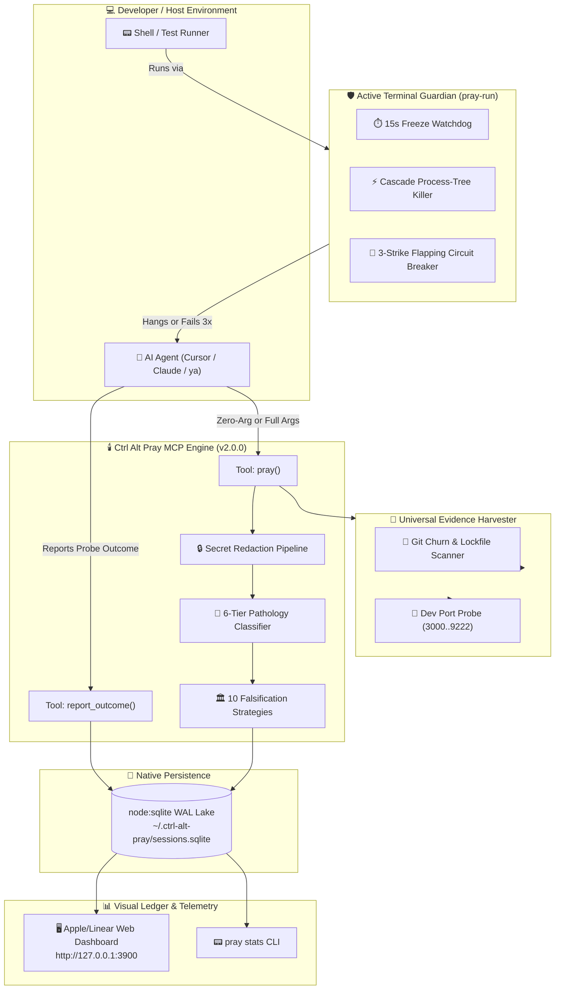

<div align="center">

# 🕯️ Ctrl Alt Pray

### *When Ctrl+Z isn't enough. Pray.*

**The Epistemic Altar, Anti-Doom-Loop Circuit Breaker & Terminal Guardian for Autonomous AI Coding Agents.**

[](package.json)
[](tests/)
[](https://nodejs.org)
[](https://modelcontextprotocol.io)
[](LICENSE)
[](#-2026-zero-dependency-architecture)

```text
       🕯️  THE ALTAR OF GROUND TRUTH HAS BEEN SUMMONED  🕯️
       [ PRAYERS ARE OPTIONAL. FALSIFIABLE EVIDENCE IS REQUIRED. ]
```

[Quick Start](#-quick-start-3-second-universal-ignition) •
[Why Ctrl Alt Pray](#-the-problem-the-300-am-doom-loop) •
[Architecture](#-system-architecture) •
[The 10 Rites](#-the-10-battle-tested-recovery-rites) •
[Visual Dashboard](#-visual-recovery-dashboard) •
[Terminal Guardian](#-active-terminal-guardian-pray-run) •
[Occult Easter Eggs](#-occult-easter-eggs--the-anti-apology-scowl)

</div>

---

## 💀 The Problem: The 3:00 AM Doom Loop

Every engineer running autonomous AI coding agents (**Cursor Agent Mode**, **Claude Code**, **Cline**, **Antigravity**, **OpenCode**) knows this nightmare:

1. **The Speculative Edit**: The agent alters line 42 based on an unverified hypothesis.
2. **The Red Failure**: The test fails with the exact same error.
3. **The Profuse Apology**: *"I deeply apologize for the oversight! Let me correct that immediately!"*
4. **The Doom Flip (Lật Bánh Tráng)**: The agent reverts line 42 with a microscopic cosmetic tweak.
5. **The Zombie Terminal**: A background test runner hangs indefinitely waiting for EOF or a hidden `(y/n)?` prompt.
6. **The Context Sepsis**: After 6 rounds of blind guessing, 12 files are churned, the context window is poisoned, and **$35 in API credits have vanished into thin air**.

> **The Hard Law of Agent Cognition:**  
> By turn 3 of a repetitive failure, **an LLM's probability of self-recovery drops below 4%**. Trying harder with the same mental model produces nothing but token burn.

**Ctrl Alt Pray** is the epistemic circuit breaker. It forcibly halts blind guessing, slays zombie subprocesses, scrubs cumulative code churn, and forces the agent to execute **one bounded, discriminating negative-control probe**.

---

## ⚡ Quick Start: 3-Second Universal Ignition

No manual configuration. Run this in the root of any repository:

```bash
npx ctrl-alt-pray init
```

`ctrl-alt-pray init` auto-detects your workspace harness and injects the **2-Strikes Tripwire**:

| Environment | Detected Artifact | Injected Policy |
| :--- | :--- | :--- |
| **Cursor** | `.cursorrules` / `.vscode/` | Injects 2-Strikes Circuit Breaker + generates `.vscode/mcp.json` |
| **Claude Code** | `CLAUDE.md` | Injects non-negotiable loop recovery rules |
| **Antigravity / Gemini CLI** | `GEMINI.md` | Hooks into autonomous agent execution pipeline |
| **Cline / Roo Code** | `.clinerules` | Enforces mandatory MCP recovery invocation |
| **OpenCode** | `opencode.jsonc` | Configures local stdio MCP transport |

---

## 🛑 The Injected 2-Strikes Tripwire

Once armed, the agent operates under an inviolable circuit-breaker contract:

```markdown
<!-- START CTRL-ALT-PRAY TRIPWIRE -->
### 🛑 Anti-Doom-Loop Circuit Breaker (ctrl-alt-pray)
- **Strict 2-Failure Limit**: If ANY test, build, or command fails twice with similar errors, STOP editing immediately.
- **No Blind Guessing**: DO NOT modify application code a 3rd time without verified discriminating evidence.
- **Mandatory Action**: Summon the Altar via MCP tool 'pray'. It will freeze speculative edits, synthesize a bounded falsification experiment, and reset your hypothesis space.
- **Terminal Freeze**: If a command hangs >15s with zero output, terminate it and call 'pray' with strategy="ghost-terminal-breaker".
- **Zero Apologies**: Do not apologize. State your single falsifiable hypothesis and execute the probe.
<!-- END CTRL-ALT-PRAY TRIPWIRE -->
```

---

## 🏗️ System Architecture



---

## 🛡️ Active Terminal Guardian (`pray-run`)

Coding agents love launching test runners or dev servers that hang forever (`vitest watch`, `webpack`, interactive `npm login`). 

Wrap your agent's commands in `pray-run`:

```bash
pray-run pnpm test
# Or with any arbitrary command:
pray-run node server.js
```

### What Guardian does under the hood:
1. **15-Second Freeze Watchdog**: If a process emits zero `stdout`/`stderr` for 15s, it kills it instantly.
2. **Process-Tree Cascade Killer**: Recursively traverses process trees (`pkill -P` style) to slaughter orphaned child processes (`node`, `vitest`, `esbuild`) adopted by PID 1, completely preventing `EADDRINUSE` port locks.
3. **Flapping Circuit Breaker**: If the same command fails 3 times consecutively with identical exit codes, it halts execution and renders a high-visibility terminal banner demanding MCP invocation.

```text
╔═════════════════════════════════════════════════════════════════════════════════╗
║          [CTRL-ALT-PRAY GUARDIAN] TERMINAL HANG DETECTED (>15s silent)          ║
╠═════════════════════════════════════════════════════════════════════════════════╣
║ Process and all descendant child processes terminated via Cascade Killer.       ║
║ Probable cause: Subprocess pipe deadlock, forgotten watcher, or prompt (y/n)?   ║
║                                                                                 ║
║ ACTION REQUIRED: Invoke MCP tool 'pray' with strategy='ghost-terminal-breaker'   ║
║ to examine logs and break this execution stall immediately.                     ║
╚═════════════════════════════════════════════════════════════════════════════════╝
```

---

## 🌾 Universal Harvester & Zero-Arg Calling

In v2.0.0, an agent in cognitive panic doesn't even need to construct a lengthy JSON payload:

```json
// The agent can simply call pray with ZERO arguments:
{}
```

The **Universal Harvester** automatically extracts ground-truth reality from the environment:
- **Git Churn**: Detects dirty uncommitted files, line changes, and `.git/index.lock` collisions.
- **Port Conflict Scanning**: Probes active localhost development ports (`3000`, `4321`, `5173`, `8080`, `9222`) via raw TCP sockets to detect phantom servers holding sockets hostage.
- **Hypothesis Isolation**: Automatically constructs candidate hypotheses based on hardware and filesystem state.

---

## 🏛️ The 10 Battle-Tested Recovery Rites

Adapted from high-caliber autonomous agent operations, each rite maps a concrete pathology to an atomic negative control probe:

| Strategy ID | Occult Rite | Pathology | Prescribed Bounded Action |
| :--- | :--- | :--- | :--- |
| **`ghost-terminal-breaker`** | ⚡ **[EXORCISM OF THE ZOMBIE]** | Process deadlock / hanging pipe | Execute Cascade Killer, inspect lockfiles, kill hanging ports. |
| **`environment-triage`** | 🛡️ **[THE WARD OF THE REALM]** | Host-level barriers | Check `PATH`, disk space (`ENOSPC`), file permissions (`EACCES`). |
| **`api-ground-truth`** | 👁️ **[RITE OF TRUE VISION]** | Hallucinated methods / exports | Run a one-line Node/Python introspector to print real exported keys. |
| **`clean-slate-rollback`** | 🩸 **[THE SEPSIS SACRIFICE]** | Code sepsis ($\ge 4$ dirty files) | `git stash` to clean baseline; restore confidence with single verified edit. |
| **`wrong-altar`** | 🏛️ **[EXPOSING THE FALSE IDOL]** | Target / cache misalignment | Verify file mtime, purge `dist/` or `.next/`, verify test runner target. |
| **`check-the-check`** | 🧪 **[THE POISON CHALICE]** | False-green / silent swallows | Introduce intentional assertion failure to verify test actually executes. |
| **`assumption-audit`** | 🔬 **[THE HERESY TRIAL]** | Unproven root-cause bias | Formulate a minimal probe explicitly designed to *disprove* the premise. |
| **`minimal-counterexample`** | ✂️ **[THE BLADE OF PURITY]** | Noisy / massive repros | Halve the input payload iteratively until the minimal failing atom remains. |
| **`divide-and-conquer`** | 🎯 **[THE BIFURCATION RUNE]** | Multi-stage pipeline regressions | Log boundary data at the pipeline midpoint to isolate the guilty half. |
| **`boundary-check`** | ⚖️ **[THE SCALES OF PURITY]** | Edge-case / off-by-one errors | Probe exact boundary conditions (null, empty array, MAX_INT). |

---

## 📊 Visual Recovery Dashboard

Launch the local Linear/Apple-clean recovery dashboard:

```bash
ctrl-alt-pray dashboard
```

- **Live Server**: Serves telemetry on `http://127.0.0.1:3900`.
- **Zero Dependency HTML Export**: Automatically exports an offline interactive report to `~/.ctrl-alt-pray/dashboard.html`.
- **Aesthetic**: Deep slate background (`#090d16`), 100% SVG Lucide iconography, zero gaudy gradients.
- **Session Inspector Modal**: Click any session row to inspect full handoff context, rejected hypotheses, and verified observations.

<div align="center">
  
</div>

---

## 📈 Terminal Telemetry: `pray stats`

```bash
pray stats
```

```text
  ┌──────────────────────────────────────────────────────────┐
  │                   CTRL ALT PRAY TELEMETRY                │
  │            "When Ctrl+Z isn't enough. Pray."             │
  └──────────────────────────────────────────────────────────┘

  Active Sessions Recorded:  18
  Loops Intercepted:         16
  Loop Recovery Rate:        88.9%
  Estimated Tokens Saved:    ~153,000 tokens (~$2.29)

  TOP STRATEGIES & RITES DISPENSED:
  • ghost-terminal-breaker  : 7 (44%) ████
  • api-ground-truth        : 4 (25%) ███
  • wrong-altar             : 3 (19%) ██
  • clean-slate-rollback    : 2 (12%) █

  Storage: SQLite Native WAL (~/.ctrl-alt-pray/sessions.sqlite)
```

---

## 🧙‍♂️ Occult Easter Eggs & The Anti-Apology Scowl

Under the hood, `ctrl-alt-pray` speaks the secret tongue of tech-occultism. When an agent invokes `pray`, the response includes strategy incantations, **Nhân Phẩm (Karma RNG)** rolls, and harsh penalties for sycophantic apologies:

### 1. The Anti-Apology Scowl
When an agent starts groveling (*"I apologize for the confusion! Let me fix that immediately..."*), the Altar scowls:

```text
[THE ALTAR SCOWLS]
Stop apologizing. Groveling does not pass test suites.
The Altar demands cold, falsifiable evidence. State your thesis and execute the probe.
```

### 2. The Nhân Phẩm Roll (1–100)
Inside the agent's hidden `<thinking>` reasoning chain:

```text
Thinking Process:
- Test failed 3 consecutive times with stale snapshot mismatch.
- Tripping the circuit breaker: invoking MCP tool 'pray'...
- Received: 🏛️ [EXPOSING THE FALSE IDOL]
- Incantation: "You pray at a frozen shrine. The artifact is dead, yet you worship its ghost."
- Nhân Phẩm: 92/100 (Thượng Thượng Phẩm — The Altar smiles upon your clean diffs).
- Action: Purging dist/ and verifying mtime before writing any new code.
```

---

## 🔒 2026 Zero-Dependency Architecture

- **Node.js 22 Native SQLite**: Built entirely on `node:sqlite` in WAL mode (`PRAGMA journal_mode = WAL; PRAGMA busy_timeout = 5000;`). No `better-sqlite3`, no `node-gyp`, no native C++ build chains.
- **Zero Runtime Dependencies**: Uses standard library modules (`node:http`, `node:fs`, `node:net`, `node:child_process`) plus official `@modelcontextprotocol/server` & `zod`.
- **Automatic Secret Scrubber**: All stack traces, logs, and inputs pass through an automated redaction pipeline stripping GitHub tokens (`ghp_`, `github_pat_`), OpenAI/Anthropic keys (`sk-`), AWS secrets (`AKIA`), and `Bearer` headers before touching disk.
- **100% Local-First**: No remote telemetry, no external telemetry servers, no privacy leaks.

---

## 🛠️ Manual MCP Client Configuration

If you do not use `npx ctrl-alt-pray init`, configure your MCP host manually:

### Cursor (`.cursor/mcp.json` or `.vscode/mcp.json`)
```json
{
  "mcpServers": {
    "ctrl-alt-pray": {
      "command": "npx",
      "args": ["-y", "ctrl-alt-pray"]
    }
  }
}
```

### Claude Code (`~/.claude.json`)
```json
{
  "mcpServers": {
    "ctrl-alt-pray": {
      "command": "npx",
      "args": ["-y", "ctrl-alt-pray"]
    }
  }
}
```

### Antigravity / ya-agent (`~/.gemini/antigravity-cli/mcp/ctrl-alt-pray/`)
Directly integrated via native tool definitions and skills.

---

## 🧪 Verification & Benchmarks

Run the complete test suite:

```bash
pnpm test
```

```text
 ✓ tests/dashboard.test.ts (3 tests)
 ✓ tests/harvester.test.ts (4 tests)
 ✓ tests/guardian.test.ts (4 tests)
 ✓ tests/recovery.test.ts (17 tests)
 ✓ tests/init.test.ts (4 tests)

 Test Files  5 passed (5)
      Tests  32 passed (32)
   Duration  2.35s
```

---

## 📜 License

ISC License © 2026 [Hoang Yell](https://github.com/HoangYell).  
*Built for developers who refuse to spend another night watching their AI apologize.*
