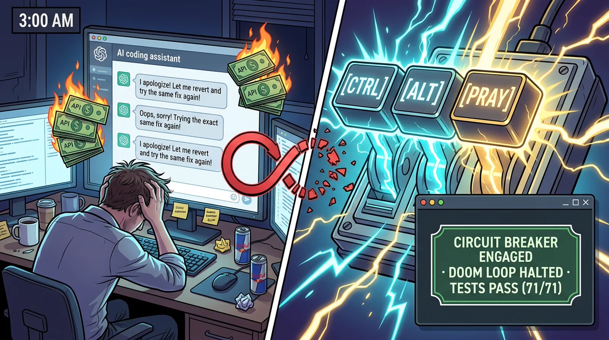

<div align="center">

# 🕯️ Ctrl Alt Pray

### *When Ctrl+Z isn't enough. Pray.*

**The open-source anti-loop circuit breaker for Cursor, Claude Code, Cline, and autonomous coding agents.**  
*Halt circular edits. Kill zombie terminals. Force your AI to check reality before burning your API budget.*

[](https://github.com/HoangYell/ctrl-alt-pray)
[](https://ctrl-alt-pray.pages.dev)
[](https://www.npmjs.com/package/ctrl-alt-pray)
[](package.json)
[-10b981.svg?style=flat-square)](tests/)
[](https://nodejs.org)
[](#-local-evidence-ledger)
[](#-why-developers-star-this)
[](LICENSE)

<br/>

<a href="https://ctrl-alt-pray.pages.dev">
  
</a>

```text
       🕯️  THE ALTAR OF GROUND TRUTH HAS BEEN SUMMONED  🕯️
       [ PRAYERS ARE OPTIONAL. FALSIFIABLE EVIDENCE IS REQUIRED. ]
```

**[🌐 Live Website & Simulator](https://ctrl-alt-pray.pages.dev) • [⭐ Star on GitHub](https://github.com/HoangYell/ctrl-alt-pray) • [📚 Articles Hub](articles/) • [Quickstart in 10s](#-quickstart-10-seconds) • [Why Pray?](#-why-pray-the-developer-story-behind-the-name) • [5 Real Practice Traps](#-5-real-traps-that-break-ai-agents-in-practice) • [The 12 Canonical Rites](#-the-12-canonical-recovery-recipes)**

</div>

---

## 💡 What Is This In 10 Seconds?

You give an autonomous AI agent (Cursor, Claude Code, Cline, etc.) a failing test to fix.

Attempt 1 fails. Attempt 2 fails.  
Instead of stopping, your agent enters **The 3:00 AM Doom Loop**:
- It apologizes profusely (*"I apologize for the confusion! Let me fix that!"*).
- It tweaks random lines of code, reverts its own previous edits, and tweaks them again.
- It burns $20 in tokens while the true bug was a **stale build cache** or a **deadlocked port 3000**.

**`ctrl-alt-pray` fixes this with 3 ironclad rules:**
1. **The 2-Strikes Circuit Breaker**: If the AI fails twice on the same check, it is **strictly barred from editing code**.
2. **The `pray()` MCP Tool**: The AI is forced to call `pray()`. The tool scans git status, locked ports, and error logs, and prescribes **ONE bounded sanity check** instead of another blind guess.
3. **The Terminal Guardian (`pray-run`)**: If a background test watcher or process freezes for >15 seconds, it kills the entire process tree (`SIGKILL`) to reclaim your dev ports.

---

## 🕯️ Why "Pray"? (The Developer Story Behind The Name)

Every engineer who has stayed up until 3:00 AM watching an AI agent hallucinate across 20 files knows this feeling:

You tried `Ctrl+C`. You tried `Ctrl+Z`. You tried rewriting your prompt. Nothing worked.  
You put your head in your hands and literally whispered:  
> *"Please God, just let this build pass."*

We turned that developer despair into an open-source engineering tool.

### How `pray` Actually Works In Practice
When your AI hits the 2-failure limit, the injected rule tells it:  
**"STOP editing code. Invoke the `pray` tool."**

The AI literally calls:
```json
{
  "tool": "pray",
  "arguments": {
    "error": "Expected 200, received 401",
    "failed_attempts": 2
  }
}
```

When `pray` is invoked, it forces the agent to take a breath:
1. **Silences the Apology Tax**: The AI is forbidden from generating polite placating filler. Apologizing costs tokens and pollutes the context window.
2. **Checks Physical Reality**: The tool inspects uncommitted git churn, occupied ports (`:3000`, `:5173`), and test artifacts.
3. **Returns Ground Truth**: The tool dispenses 1 of 12 proven diagnostic recipes (e.g., *"Stop editing `src/`. You forgot to rebuild `dist/`."*).
4. **Resets the Search Space**: The agent runs one atomic check, discovers the actual root cause, and fixes it in 1 clean commit.

---

## 🛠️ 5 Real Traps That Break AI Agents In Practice

Here are the exact daily failure modes where autonomous agents burn your money—and how `pray()` resolves each in seconds:

### Trap 1: The Stale Build Mirage (Editing `src/`, testing `dist/`)
- **The Pain**: The AI edits `src/auth.ts`, runs `pnpm test`, and fails. The AI assumes its logic was wrong, so it rewrites the file 5 times. But the test runner was executing stale code in `dist/auth.js` because nobody ran `pnpm build`! The agent burns 40,000 tokens editing the right file for the wrong reason.
- **How `pray` Fixes It**: `pray()` dispenses **Recipe 01: Exposing the False Idol**. It injects a unique diagnostic marker into source. When the marker is absent from stdout, it immediately informs the agent: *"Your code edits produce zero change in test output. You are editing source while tests run against stale dist. Run build first."*

### Trap 2: The Port Zombie (Port 3000 locked by orphaned PID)
- **The Pain**: An earlier test run spawned a background Vite server or test watcher. It hung silently. The next turn, the agent tries to run the server and gets `EADDRINUSE: port 3000 already in use`. The agent hallucinates and changes the port to 3001 in config, breaking frontend-backend contracts and creating configuration drift.
- **How `pray` Fixes It**: `pray-run` terminates commands that hang >15s without output. When `pray()` is called, its Harvester probes standard dev ports (`3000`, `5173`, `8080`), identifies the orphan process, and runs a cascade kill tree (`SIGKILL -9`) to release the socket in <100ms.

### Trap 3: The Apology & Guesswork Spiral
- **The Pain**: *"I apologize! Let me inspect the PostgreSQL balance schema..."* *"My mistake, let me revert and rewrite the cookie parser..."* Every turn, the AI spends 1,500 tokens apologizing and spinning up elaborate new explanations for a problem it doesn't understand.
- **How `pray` Fixes It**: The tripwire penalizes conversational filler and bans apologies. In the live Altar HUD, apologies incur an instant **-25 point Epistemic Karma penalty** (*Dire Wrath*). The model is strictly barred from modifying code until it executes an isolated diagnostic probe.

### Trap 4: The Poison Chalice (Swallowed Assertions / False Green)
- **The Pain**: A developer reports a bug in checkout. The AI tweaks a file and runs tests. The test suite reports green (PASS). The AI declares: *"Bug is fixed!"* But in reality, an unhandled `try/catch` in a test helper swallowed the exception, giving a false green while production remains broken.
- **How `pray` Fixes It**: `pray()` dispenses **Recipe 02: The Poison Chalice**. It instructs the agent to inject a deliberate failing assertion (`assert(1 === 2)`) inside the checkout path. When the test still passes, the agent proves the test is broken before shipping fake fixes to production.

### Trap 5: The Hallucinated Method Loop
- **The Pain**: The AI tries calling `client.getUser()`. Fails with `TypeError: client.getUser is not a function`. It guesses `client.fetchUser()`. Fails. It guesses `client.findUser()`. Fails. It tries to invent polyfills instead of checking the library's actual exports.
- **How `pray` Fixes It**: `pray()` dispenses **Recipe 04: Rite of True Vision**. It commands the agent to execute a 1-line runtime reflection script: `node -e "import('pkg').then(m => console.log(Object.keys(m)))"`. The true method names are reflected in 50ms.

---

## ⚡ 10-Second Quickstart

### 1. Provision Your Editor (1-Click CLI Auto-Ignition)
Run this command in the root of your project:

```bash
npx ctrl-alt-pray init
```

This auto-detects your workspace and provisions the **2-Strikes Circuit Breaker** and local MCP configuration:

| Editor / Agent | 1-Click Direct Link | CLI Command | Files Armed |
| :--- | :--- | :--- | :--- |
| **Cursor** | [⚡ 1-Click Cursor Install](cursor://anysphere.cursor-deeplink/mcp/install?name=ctrl-alt-pray&config=eyJjb21tYW5kIjoibnB4IiwiYXJncyI6WyIteSIsImN0cmwtYWx0LXByYXkiXX0%3D) | `npx ctrl-alt-pray init cursor` | `.cursorrules` + `.cursor/mcp.json` |
| **VS Code / Copilot** | [⚡ 1-Click VS Code Install](https://vscode.dev/redirect/mcp/install?name=ctrl-alt-pray&config=%7B%22command%22%3A%22npx%22%2C%22args%22%3A%5B%22-y%22%2C%22ctrl-alt-pray%22%5D%7D) | `npx ctrl-alt-pray init vscode` | `AGENTS.md` + `.vscode/mcp.json` |
| **Claude Code** | Native CLI Hook | `npx ctrl-alt-pray init claude` | `CLAUDE.md` + `.mcp.json` |
| **Windsurf (Codeium)** | Auto-detected | `npx ctrl-alt-pray init windsurf` | `.windsurfrules` + `.windsurf/mcp.json` |
| **Cline & Roo Code** | Auto-detected | `npx ctrl-alt-pray init cline` | `.clinerules` + `cline_mcp_settings.json` |
| **Zed Editor** | Auto-detected | `npx ctrl-alt-pray init zed` | `.zed/settings.json` |
| **JetBrains AI** | Auto-detected | `npx ctrl-alt-pray init jetbrains` | `.idea/mcp.json` |
| **Google Antigravity** | Auto-detected | `npx ctrl-alt-pray init gemini` | `GEMINI.md` |

### 2. Wrap Commands With Active Terminal Guardian (`pray-run`)
Stop letting processes freeze silently. Wrap test or build runs:

```bash
pray-run pnpm test
# or
pray-run npm run build
```

If a command hangs for >15s with zero output (e.g. waiting on a hidden `(y/n)?` prompt), `pray-run` terminates the process tree automatically and outputs the unblocking action.

---

## 📜 The 12 Canonical Recovery Recipes

When an agent invokes `pray()`, the engine matches symptoms against 12 version-controlled, battle-tested recovery recipes:

| # | Recipe Key | Trigger Symptom | Prescribed Ground-Truth Action | Safety Guarantee |
| :-: | :--- | :--- | :--- | :--- |
| **01** | `wrong-altar` | Code edits produce zero change in test output; identical error | Inject unique runtime marker (`RUNNING_CHECK_<UUID>`); check stdout | Harmless print; zero mutation |
| **02** | `check-the-check` | Tests stay green despite reported bug; missing logs | Introduce deliberate failing assertion (`assert(1 === 2)`) | Temporary negative control |
| **03** | `ghost-terminal-breaker` | Command hung >15s; pipe EOF deadlock; unhandled prompt | Inspect CPU% & process tree; cascade kill if 0% CPU with frozen log | Read-only inspection; cascade kill |
| **04** | `api-ground-truth` | `TypeError: is not a function`; hallucinating method names | Run 1-line script: `node -e "console.log(Object.keys(import('...')))"` | Read-only runtime reflection |
| **05** | `clean-slate-rollback` | $\ge 4$ uncommitted files; stacked messy diffs | `git stash push -u -m "checkpoint"`; rerun minimal test | Safely stashes uncommitted work |
| **06** | `environment-triage` | `command not found`, `EACCES`, `ENOSPC`, missing binary | Verify binary path (`which`), permissions (`ls -la`), disk space (`df -h`) | Read-only host environment triage |
| **07** | `assumption-audit` | Candidate hypothesis treated as fact without proof | Execute a single diagnostic probe designed strictly to *disprove* it | Low-risk assertion or query |
| **08** | `minimal-counterexample` | Huge 10MB payload; 200 fields; noisy repro | Halve input payload repeatedly until atomic failure invariant remains | Isolated local test fixture |
| **09** | `divide-and-conquer` | Regression between commits or multi-step pipeline break | Inspect and log payload state exactly midway between entry and failure | Read-only intermediate logging |
| **10** | `controlled-substitution` | Two plausible causes separated by known-good input | Hold all variables constant and swap suspect component with verified twin | Local temporary swap |
| **11** | `boundary-check` | Subsystem boundary unclear; ambiguous stack trace | Compare inputs and outputs across component boundary before editing code | Zero mutation boundary check |
| **12** | `human-checkpoint` | Ambiguous product requirement; conflicting business spec | Formulate one concrete multiple-choice question to the human maker | Zero speculative guessing |

---

## 📊 Local Evidence Ledger & Telemetry

### Inspect Intercepted Loops
All intercepted loops and token savings are logged locally with **zero external telemetry**:

```bash
# View summary statistics in your terminal:
pray stats

# Launch the visual ledger dashboard (http://127.0.0.1:3900):
ctrl-alt-pray dashboard
```

- **Storage**: SQLite WAL mode in `~/.ctrl-alt-pray/sessions.sqlite`.
- **Privacy**: 100% offline. Zero remote telemetry. Zero analytics tracking.

---

## ⚖️ Why Developers Star This

- **Zero Runtime Dependencies**: Built entirely with native Node.js APIs (`node:net`, `node:child_process`, `node:sqlite`). Fast startup (<5ms).
- **Hard OS Constraints Over Soft Prompts**: Prompts alone cannot detect occupied sockets or kill orphaned worker processes. `ctrl-alt-pray` enforces real operating system boundaries.
- **Context Window Saver**: Cuts 20-turn circular apology loops into a 1-step resolution, saving tens of thousands of tokens per debugging session.

---

<div align="center">

**When Ctrl+Z isn't enough. Pray.**

Built with pragmatism by [Hoang Yell](https://github.com/HoangYell) • Licensed under [ISC](LICENSE)

</div>
