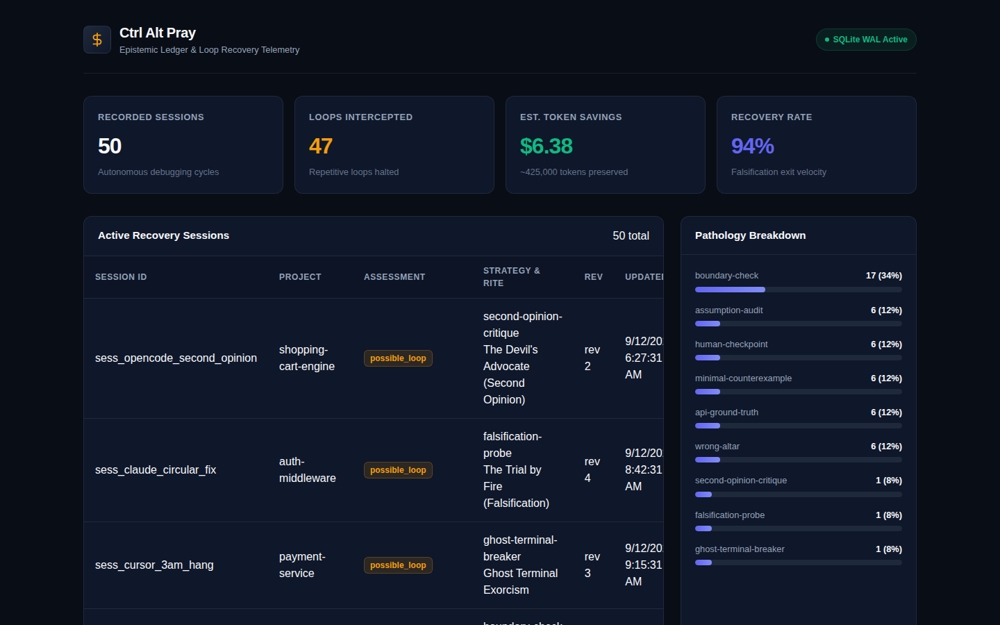

<div align="center">

# 🕯️ Ctrl Alt Pray

### *When Ctrl+Z isn't enough. Pray.*

**The open-source anti-doom-loop circuit breaker & epistemic supervisor for Cursor, Claude Code, Cline, and autonomous AI agents.**  
*Halt circular edits. Terminate zombie terminals. Force your AI to find the ground truth.*

[](https://github.com/HoangYell/ctrl-alt-pray)
[](https://ctrl-alt-pray.pages.dev)
[](https://www.npmjs.com/package/ctrl-alt-pray)
[](package.json)
[-10b981.svg?style=flat-square)](tests/)
[](https://nodejs.org)
[](#-dual-driver-storage-resilience)
[](#-why-developers-star-this)
[](LICENSE)

<br/>

<a href="https://ctrl-alt-pray.pages.dev">
  
</a>

```text
       🕯️  THE ALTAR OF GROUND TRUTH HAS BEEN SUMMONED  🕯️
       [ PRAYERS ARE OPTIONAL. FALSIFIABLE EVIDENCE IS REQUIRED. ]
```

**[🌐 Live Website & Simulator](https://ctrl-alt-pray.pages.dev) • [⭐ Star on GitHub](https://github.com/HoangYell/ctrl-alt-pray) • [📚 Engineering Articles](articles/) • [Plain English (10s)](#-plain-english-for-cynical-engineers-what-is-this-in-10s) • [Quickstart in 10s](#-quickstart-10-seconds) • [Before vs After](#-the-300-am-agony-before-vs-after) • [Core Superpowers](#-core-superpowers) • [The 12 Canonical Rites](#-the-12-canonical-recovery-recipes)**

</div>

---

## 💡 Plain English for Cynical Engineers (What is this in 10s?)

> *"Wait, is this an RPG meme, a tech cult, or actual software?"*

If you are a skeptical developer looking at this on Hacker News or GitHub, here is the no-BS explanation:

1. **What it is**: An open-source local **MCP (Model Context Protocol) server + CLI runtime** for **Cursor, Claude Code, Cline, and terminal coding agents**. Zero runtime dependencies. 100% TypeScript. Local SQLite ledger.
2. **The Exact Problem it Solves**: **The AI Doom Loop.** You give an AI agent a bug to fix. Attempt 1 fails. Instead of stopping, the agent apologizes, hallucinates alternative APIs, swaps random lines, and reverts its own code in an infinite loop—burning $20 in tokens while the real defect was a deadlocked dev port or a stale build cache.
3. **How it Works in 3 Steps**:
   - **Step 1 (The Tripwire)**: `npx ctrl-alt-pray init` injects a non-negotiable rule into `.cursorrules`, `CLAUDE.md`, or `GEMINI.md`. If the AI fails twice consecutively, it is **strictly blocked from writing more code**.
   - **Step 2 (The Evidence Ledger)**: The AI is forced to call the `pray()` tool. The tool inspects git status, dirty diffs, and locked ports, and provides 1 of 12 canonical falsification probes (e.g. purge cache, isolate port, run 1-variable probe).
   - **Step 3 (The Cascade Killer)**: `pray-run` wraps shell commands. If a command hangs on a hidden `(y/n)?` prompt or an orphaned test process for >15s, it kills the entire process tree (`SIGTERM` $\rightarrow$ `SIGKILL`).
4. **Why not just write a prompt?**:
   Prompts cannot inspect whether port 3000 is open, cannot check git status, cannot kill orphaned processes, have no cross-session state, and LLMs routinely ignore prompt rules when under cognitive tunnel vision. `ctrl-alt-pray` provides hard, deterministic constraints.
5. **Why the church / praying theme?**:
   Because every engineer at 3:00 AM who has watched an AI agent hallucinate through 20 files has tried `Ctrl+C`, `Ctrl+Z`, and was left with only one remaining strategy: **praying**. We turned developer agony into an open-source engineering tool.

---

## 💀 The 3:00 AM Agony: Before vs After

Every software engineer working with autonomous coding agents knows this visceral frustration:

| ❌ Without `ctrl-alt-pray` | ✅ With `ctrl-alt-pray` |
| :--- | :--- |
| **Attempt 1:** AI edits line 42. Test fails. | **Attempt 1:** AI edits line 42. Test fails. |
| **Attempt 2:** *"I apologize for the confusion! Let me fix that!"* AI edits line 42 again. Test fails. | **Attempt 2:** AI tries again and fails. **CIRCUIT BREAKER TRIPS.** |
| **Attempt 3:** AI edits line 43. Reverts line 42. Still fails. | **🛑 In-Context Tripwire**: AI is strictly forbidden from writing code without new discriminating evidence. |
| **Attempt 5:** Terminal hangs for 20 minutes because a dev command was waiting on an unhandled `(y/n)?` prompt. | **⚡ Active Guardian (`pray-run`)**: Detects silence >15s, executes **Cascade Tree Kill** on orphaned child processes, and frees occupied dev ports. |
| **Attempt 8:** 14 dirty files churned. Hallucinated function exports stacked. Context window saturated. | **🌾 Universal Harvester**: Checks git & ports automatically: *"You edited `src/` but tests execute stale `dist/`."* |
| **Attempt 14:** AI apologizes for the 10th time, burns another 50k tokens re-explaining the same false premise. | **🔥 Heresy Mode**: Slaps the AI with an iconoclastic falsification probe, resetting hypothesis space to ground reality. |
| **Result:** $28 in API tokens burned. Dirty git working tree. 2 hours lost. Bug still broken. | **Result:** Subsystem isolated in 30 seconds. Baseline restored. **$0.02 spent.** |

> **The Empirical Law of AI Coding Loops:**  
> If an AI agent fails twice consecutively on the same defect, attempting a third speculative patch with the same assumptions rarely succeeds — the agent is guessing, not gathering evidence. Without an external circuit breaker, it will apologize profusely, hallucinate alternate APIs, and burn your context window.


---

## 🕯️ The Cyber-Occultism Manifest: Why Your AI Agent Needs to Pray

> *"When mathematics dies, logic fractures, and Ctrl+Z fails at 3:00 AM: Stop writing prompts. Introduce your AI to religion."*

Why does a battle-tested engineering runtime like `ctrl-alt-pray` embrace **Tech-Occultism**? Because every software engineer who has stayed up all night with an autonomous coding agent knows the visceral despair: The AI enters an infinite cognitive doom loop, flips the same boolean back and forth, apologizes 14 times, and burns $25 in API tokens while the real defect was an orphaned background process or a stale build cache.

At 3:00 AM, conventional prompt engineering is dead. The only thing that can save the system is **a digital cyber-ritual backed by deterministic iron constraints**:

<div align="center">
  
  <p><em>🕯️ 03:00 AM — Developer and AI Agent kneeling before The Altar of Ground Truth.</em></p>
</div>

---

### 🎲 1. Divine Favor & The Anti-Apology Penalty (`rollDivineFavor`)

Inside the model's reasoning trace (`<thinking>`), whenever the agent calls `pray()`, the Altar rolls an epistemic karma dice (1–100):

<div align="center">
  
</div>

- **Base Karma**: 65 to 95 points.
- **The Anti-Apology Penalty (-25 pts)**: If the agent generates placating conversational filler (*"I apologize for the confusion! Let me correct..."*), the Altar immediately docks **25 points of Divine Favor**.
- **Flapping Penalty (-15 pts)**: If the agent repeats failed attempts >3 times without new evidence, karma plummets into the abyss.

#### 📜 The Altar's Verdict Matrix (Divine Favor):
| Score | Divine Verdict | Meaning from the Altar | Agent State |
| :---: | :--- | :--- | :--- |
| **$\ge 80$** | 🌟 **Transcendent Grace** | *Divine Favor bestowed.* Peak intuition; probe isolates root defect in 1 bounded step. | Enlightened |
| **$60 - 79$** | 🕯️ **Auspicious Omen** | *Favorable omen.* Working tree and ports validated; ready to break the loop. | Grounded |
| **$40 - 59$** | ⏳ **Trial of Patience** | *Temperate grace.* The Altar demands re-verifying foundational premises before editing. | Cautious |
| **$< 40$** | ⚡ **Dire Wrath (Altar Scorn)** | *Wrath of the Altar.* **Guilty of apologies or circular churn!** Code edits barred until empirical evidence is produced! | Sealed / Bound |

> *"The Gods accept no apologies from mortals. Apologies do not pass test suites. Produce falsifiable evidence or be purged."*

---

### ⚡ 2. Exorcism of Zombie Subprocesses (`[EXORCISM OF THE ZOMBIE]`)

One of the classic 3:00 AM pathologies is the **phantom child subprocess**—background dev/test watchers trapping port `3000` or freezing on an unhandled `(y/n)?` prompt.

<div align="center">
  
  <p><em>⚡ Cyber-Exorcism: The AI Monk brandishing a <code>SIGKILL -9</code> talisman to banish zombie subprocesses.</em></p>
</div>

- **Silent Freeze Watchdog (>15s)**: `pray-run` monitors child I/O streams. If the terminal stays mute for >15s with 0% CPU, the exorcism triggers automatically.
- **The `SIGKILL -9` Talisman**: Executes a recursive cascade process-tree kill, terminates orphaned PIDs, frees locked network ports, and purges stale `.git/index.lock` in milliseconds.

---

### 📜 3. The 12 Holy Rites & Incantations Reference

Rather than vague tips, the Altar dispenses 12 canonical rites injected directly into the LLM's `<thinking>` block:

| Strategy Key | Holy Rite Name | Incantation (Dispensed to Agent Thinking) | Production Superpower |
| :--- | :--- | :--- | :--- |
| `ghost-terminal-breaker` | ⚡ **[EXORCISM OF THE ZOMBIE]** | *"Banish the mute terminal. Sever the orphaned child tree of PID 1. Let the stdin flow free."* | Kills zombie processes trapping dev ports or hanging on prompt inputs. |
| `wrong-altar` | 🏛️ **[EXPOSING THE FALSE IDOL]** | *"You pray at a frozen shrine. The build artifact is stale; kindle the fire of a fresh compilation."* | Exposes agents editing `src/` while tests execute stale `dist/` bundles. |
| `clean-slate-rollback` | 🩸 **[THE SEPSIS SACRIFICE]** | *"The Altar rejects hands coated in cumulative dirt. Cast the uncommitted churn into git stash. Purity precedes revelation."* | Stashes debugging debris into git stash to restore a clean baseline. |
| `check-the-check` | 🧪 **[THE POISON CHALICE]** | *"A green test is an illusion if it cannot die. Force it to taste poison to prove it lives."* | Injects deliberate failing assertion to unmask tests swallowing errors. |
| `api-ground-truth` | 👁️ **[RITE OF TRUE VISION]** | *"Scry the sacred node_modules directly. Heed not the phantom whispers of hallucinated exports."* | Inspects runtime exports via reflection, ending recursive API hallucination. |
| `assumption-audit` | 🔬 **[THE HERESY TRIAL]** | *"Challenge the unwritten dogma. Subject your foundational premise to the crucible of falsification."* | Forces agent to test its core hypothesis rather than applying speculative patches. |
| `minimal-counterexample` | ✂️ **[THE BLADE OF PURITY]** | *"Sever the bloated payload. Halve the mortal frame until only the atomic essence of failure remains."* | Bisects massive payloads to isolate the exact failing invariant. |
| `divide-and-conquer` | 🎯 **[THE BIFURCATION RUNE]** | *"Split the veil in twain. Probe the midpoint boundary to locate which domain harbors the anomaly."* | Probes pipeline midpoint to cut the search space in half. |
| `controlled-substitution` | ⚖️ **[THE SCALES OF PURITY]** | *"Swap one known-true component for the suspect element. Observe where the balance tilts."* | Swaps verified-good fixture to contrast against failing component. |
| `boundary-check` | 🛡️ **[THE PERIMETER WARD]** | *"Cast the ward at the subsystem border. Verify what crosses before disturbing internal sanctums."* | Verifies boundary inputs/outputs before modifying internal logic. |
| `environment-triage` | 🛡️ **[THE WARD OF THE REALM]** | *"Do not blame the scripture when the altar stone is missing. Verify the binary and permissions of the mortal realm."* | Checks `chmod` permissions, disk space, and missing host executables. |
| `human-checkpoint` | 🕯️ **[SUMMONING THE CREATOR]** | *"Mortals reach their limit. Pose one discriminating question to the Human Maker."* | Summons the human developer with one structured, unblocking question. |

---

## ⚡ 1-Click Quickstart & MCP Setup <a id="-quickstart-10-seconds"></a>

<p align="center">
  <a href="cursor://anysphere.cursor-deeplink/mcp/install?name=ctrl-alt-pray&config=eyJjb21tYW5kIjoibnB4IiwiYXJncyI6WyIteSIsImN0cmwtYWx0LXByYXkiXX0%3D" title="Install directly in Cursor">
    
  </a>
  &nbsp;&nbsp;
  <a href="https://vscode.dev/redirect/mcp/install?name=ctrl-alt-pray&config=%7B%22command%22%3A%22npx%22%2C%22args%22%3A%5B%22-y%22%2C%22ctrl-alt-pray%22%5D%7D" title="Install directly in VS Code">
    
  </a>
  &nbsp;&nbsp;
  <a href="https://ctrl-alt-pray.pages.dev/#mcp-setup" title="Launch Interactive 1-Click Web Configurator">
    
  </a>
</p>

Arm your workspace with the **2-Strikes Circuit Breaker** and the **MCP Altar** in seconds:

```bash
# Universal 1-Click Auto-Ignition (auto-detects Cursor, Claude, VS Code, Windsurf, Cline, etc.):
npx ctrl-alt-pray init
```

### 📋 Supported Editors & Provisioning Matrix

| Editor / Agent | 1-Click Direct Install | CLI Auto-Ignition | Provisioned Files & Tripwires |
| :--- | :--- | :--- | :--- |
| **Cursor** | [⚡ 1-Click Install](cursor://anysphere.cursor-deeplink/mcp/install?name=ctrl-alt-pray&config=eyJjb21tYW5kIjoibnB4IiwiYXJncyI6WyIteSIsImN0cmwtYWx0LXByYXkiXX0%3D) | `npx ctrl-alt-pray init cursor` | `.cursorrules` + `.cursor/mcp.json` |
| **VS Code / Copilot** | [⚡ 1-Click Install](https://vscode.dev/redirect/mcp/install?name=ctrl-alt-pray&config=%7B%22command%22%3A%22npx%22%2C%22args%22%3A%5B%22-y%22%2C%22ctrl-alt-pray%22%5D%7D) | `npx ctrl-alt-pray init vscode` | `AGENTS.md` + `.vscode/mcp.json` |
| **Claude Code** | Native CLI hook | `npx ctrl-alt-pray init claude` | `CLAUDE.md` + `.mcp.json` |
| **Windsurf (Codeium)** | Auto-detected | `npx ctrl-alt-pray init windsurf` | `.windsurfrules` + `.windsurf/mcp.json` |
| **Cline & Roo Code** | Auto-detected | `npx ctrl-alt-pray init cline` | `.clinerules` + `cline_mcp_settings.json` |
| **Zed Editor** | Auto-detected | `npx ctrl-alt-pray init zed` | `.zed/settings.json` (`context_servers`) |
| **JetBrains AI** | Auto-detected | `npx ctrl-alt-pray init jetbrains` | `.idea/mcp.json` |
| **Google Antigravity** | Auto-detected | `npx ctrl-alt-pray init gemini` | `GEMINI.md` |
| **All Editors in 1 Shot** | — | `npx ctrl-alt-pray init --all` | Provisions all 9 environments simultaneously |

> [!TIP]
> ### 🌐 Interactive 1-Click Web Configurator
> Want to test live simulator probes, copy custom prompt snippets, or download ready-made `.json` files directly to your machine?  
> 👉 **[Launch the 1-Click Web Configurator (ctrl-alt-pray.pages.dev/#mcp-setup) →](https://ctrl-alt-pray.pages.dev/#mcp-setup)**

---

## 🏛️ The 4-Tier Trigger Architecture

Autonomous agents trapped in doom loops suffer from cognitive tunnel vision—they lack the meta-cognition to declare *"I am stuck"*. `ctrl-alt-pray` operates an active 4-tier hierarchy to intercept failures:

```text
┌─────────────────────────────────────────────────────────────────────────────┐
│                    4-TIER ANTI-DOOM-LOOP ARCHITECTURE                       │
├─────────────────────────────────────────────────────────────────────────────┤
│ Tier 1: Passive Schema Reflex    │ Tool schema enumerates exact symptoms    │
│ (Zero-Config Attention Bias)     │ (consecutive fails >= 2, freeze > 15s)   │
├──────────────────────────────────┼──────────────────────────────────────────┤
│ Tier 2: In-Context Tripwires     │ npx ctrl-alt-pray init generates         │
│ (System Prompt Enforcers)        │ mandatory 2-strikes circuit breaker rule │
├──────────────────────────────────┼──────────────────────────────────────────┤
│ Tier 3: Active Terminal Guardian │ pray-run wrapper detects silent freezes  │
│ (Synthetic Stream Injection)     │ & terminates zombie child process trees  │
├──────────────────────────────────┼──────────────────────────────────────────┤
│ Tier 4: The Altar & Harvester    │ Universal harvester reads git, ports,    │
│ (Autonomous Ground-Truth Engine) │ & test archaeology to prescribe probes   │
└──────────────────────────────────┴──────────────────────────────────────────┘
```

---

## 🚀 Core Superpowers

### 1. 🛑 The Injected Tripwire (The 2-Strikes Rule)
When `npx ctrl-alt-pray init` runs, it embeds an ironclad behavioral contract:

```markdown
<!-- START CTRL-ALT-PRAY TRIPWIRE -->
### 🛑 Anti-Doom-Loop Circuit Breaker (ctrl-alt-pray)
1. STRICT 2-FAILURE LIMIT: If ANY test, build, or command fails twice with the same error, STOP editing immediately.
2. NO BLIND GUESSING: Do not touch application code a 3rd time without verified new evidence.
3. MANDATORY ACTION: Invoke MCP tool 'pray'. It will freeze speculative edits and prescribe ONE bounded falsification experiment.
4. TERMINAL FREEZE: If a command hangs >15s with zero output, kill it and invoke 'pray' (strategy="ghost-terminal-breaker").
5. ZERO APOLOGIES: Do not apologize. State your single testable hypothesis and execute the probe.
<!-- END CTRL-ALT-PRAY TRIPWIRE -->
```

### 2. ⚡ Active Terminal Guardian (`pray-run`)
Tired of watching your AI run `npm test` or `vite` and freeze for 20 minutes because a process is waiting on an invisible `(y/n)?` prompt, background watcher, or locked database?

Prefix your commands with `pray-run`:

```bash
pray-run pnpm test
# or
pray-run npm run build
```

```text
╔═════════════════════════════════════════════════════════════════════════════════╗
║          [CTRL-ALT-PRAY GUARDIAN] TERMINAL HANG DETECTED (>15s silent)          ║
╠═════════════════════════════════════════════════════════════════════════════════╣
║ Process and all descendant child processes terminated via Cascade Killer.       ║
║ Probable cause: Subprocess pipe deadlock, forgotten watcher, or prompt (y/n)?   ║
║                                                                                 ║
║ ACTION REQUIRED: Invoke MCP tool 'pray' with strategy='ghost-terminal-breaker'  ║
╚═════════════════════════════════════════════════════════════════════════════════╝
```

- **15-Second Freeze Watchdog**: Spawns child commands under real-time stdout/stderr supervision.
- **Cascade Process-Tree Killer**: Recursively terminates the entire process subtree (orphaned `node`, `vitest`, `esbuild` workers adopted by PID 1), guaranteeing dev ports (`:3000`, `:5173`) and `.git/index.lock` are released.
- **Flapping Exit Code Breaker**: Tracks consecutive failures across runs in `.ctrl-alt-pray/runs.json`. If identical non-zero exit codes repeat 3 times, Guardian displays an unmissable terminal circuit breaker.

### 3. 🌾 Universal Zero-Argument Harvester (`pray()`)
When an agent is panicking, demanding that it construct a 60-line JSON payload with `candidate_hypotheses`, `observations`, and `constraints` only induces secondary hallucinations.

With `ctrl-alt-pray`, the AI can call `pray` with **zero arguments**:

```json
{}
```

The **Universal Harvester** automatically inspects runtime reality:
1. **Git Sepsis & Flapping**: Scans `git status --porcelain` and diffs. If $\ge 4$ files are dirty, flags `clean-slate-rollback`. If a file is repeatedly edited and reverted, locks edit permissions.
2. **Socket Contention**: Uses native `node:net` to probe standard dev ports (`3000`, `4321`, `5173`, `8080`, `9222`) across macOS, Linux, and Windows for stale background daemons.
3. **Pluggable AI Archaeology**: Reads test artifacts (`.vitest/`, `.pytest_cache/`, `test-results/`) and local client configs (`.cursor/`, `CLAUDE.md`, `GEMINI.md`, `.aider.chat.history.md`).

### 4. 🔥 Heresy Mode & The Offering
When an agent fixates on a false premise (*"The database query must be wrong!"* when the server is actually executing a stale build artifact):
- **Heresy Mode (`heresy_mode: true`)**: Tripped automatically on attempt 3. Challenges the foundational premise and provides a cheap, decisive falsification check:
  - *Wrong Altar*: Inject an intentional syntax error in source. If tests still pass, your source file is not being compiled.
  - *Phantom Module*: Run `node -e "import('<mod>').then(m => console.log(Object.keys(m)))"` to inspect true runtime exports instead of guessing method names.
  - *Poison Chalice*: Inject `assert.strictEqual(1, 2)` into the business logic. If tests stay green, your test suite is swallowing errors.
- **The Offering (`session.offering`)**: When the problem cannot be resolved by more code, the Altar demands missing evidence:
  - `minimal_input`: A stripped-down JSON payload with $<5$ fields isolating the bug.
  - `product_decision`: A multiple-choice business rule decision for the human owner.
  - `known_good_comparison`: A side-by-side trace of working vs broken environments.

### 5. ⚰️ Clean-Context Resurrection (`pray resurrect`)
When an agent's context window is poisoned with 30 turns of failed speculative reasoning, continuing in the same session is a waste of money.

Run:
```bash
ctrl-alt-pray resurrect [session_id]
```

Or query MCP resource `session://{session_id}/resurrection`:

The engine outputs a **compact Markdown Resurrection Packet**:
1. **The Core Goal & Constraints**: Inviolable boundaries.
2. **Verified Ground Truth**: Hard facts proven by command exit codes and passing assertions.
3. **Ruled-Out Hypotheses (DO NOT RECYCLE)**: Approaches already attempted that failed—forbids the fresh agent from repeating them.
4. **Active Bounded Probe**: Exactly ONE isolated check with clean rollback.
5. **Zero Speculative Narratives**: Wipes away the prior agent's excuses and hallucinations.

### 6. 📜 The Prayer Book: 12 Canonical Rites (`pray recipes`)
Need to browse battle-tested recovery patterns? Run:

```bash
ctrl-alt-pray recipes
# or
ctrl-alt-pray book
```

All 12 canonical recipes are version-controlled with applicability triggers, probes, outcome branches, and safety guarantees.

### 7. ⚖️ Second Opinion & Devil's Advocate (`second_opinion: true`)
When an agent or developer wants to challenge their recovery plan before touching code:
- **Adversarial Critique**: Challenges the proposed experiment to expose hidden assumptions, non-deterministic flakiness, or uncalled mocks.
- **MCP 2026 Sampling Protocol**: If the host MCP client advertises sampling (`sampling: {}`), requests an independent Devil's Advocate critique via `sampling/createMessage` with strict resource bounds (<150 tokens, 4s timeout).
- **Zero-Cost Heuristic Fallback**: Gracefully degrades to a fast, 0-token heuristic critique if sampling is unsupported or unconfigured.

---

## 🏛️ The 12 Canonical Recovery Recipes

| # | Strategy | Trigger Symptom | Prescribed Ground-Truth Probe | Safety Guarantee |
| :-: | :--- | :--- | :--- | :--- |
| **01** | `wrong-altar` | Code edits produce zero change in output; same error | Inject unique runtime marker (`RUNNING_CHECK_<UUID>`); check stdout | Harmless print; zero mutation |
| **02** | `check-the-check` | Tests stay green despite reported bug; missing logs | Introduce deliberate failing assertion (`assert(1 === 2)`) | Temporary negative control |
| **03** | `ghost-terminal-breaker` | Command hung >15s; pipe EOF deadlock; unhandled prompt | Inspect CPU% & terminal tail; cascade kill if 0% CPU with frozen log | Read-only inspection; cascade kill |
| **04** | `api-ground-truth` | `TypeError: is not a function`; hallucinating method names | Run 1-line script: `node -e "console.log(Object.keys(import('...')))"` | Read-only runtime reflection |
| **05** | `clean-slate-rollback` | $\ge 4$ uncommitted files; stacked messy diffs | `git stash push -u -m "checkpoint"`; rerun minimal test | Safely stashes uncommitted work |
| **06** | `environment-triage` | `command not found`, `EACCES`, `ENOSPC`, missing binary | Verify binary path (`which`), permissions (`ls -la`), disk space (`df -h`) | Read-only host environment triage |
| **07** | `assumption-audit` | Candidate hypothesis treated as fact without proof | Execute a single diagnostic probe designed strictly to *disprove* it | Low-risk assertion or query |
| **08** | `minimal-counterexample` | Huge 10MB payload; 200 fields; noisy repro | Halve input payload repeatedly until atomic failure invariant remains | Isolated local test fixture |
| **09** | `divide-and-conquer` | Regression between commits or multi-step pipeline break | Inspect and log payload state exactly midway between entry and failure | Read-only intermediate logging |
| **10** | `controlled-substitution` | Two plausible causes separated by known-good input | Hold all variables constant and swap suspect component with verified twin | Local temporary swap |
| **11** | `boundary-check` | Subsystem boundary unclear; ambiguous stack trace | Compare inputs and outputs across component boundary before editing code | Zero mutation boundary check |
| **12** | `human-checkpoint` | Ambiguous product requirement; conflicting business spec | Formulate one concrete multiple-choice question to the human maker | Zero speculative guessing |

---

## 📊 Visual Ledger & Telemetry Dashboard

### Live Web Dashboard (`http://127.0.0.1:3900`)
Launch the Apple/Linear minimalist recovery ledger with one command:

```bash
ctrl-alt-pray dashboard
```

<br/>

<a href="https://github.com/HoangYell/ctrl-alt-pray">
  
</a>

<br/>

- **Live UI**: Dark slate palette (`#090d16`), 100% SVG vector iconography, zero bloat.
- **Offline HTML Report**: Automatically exports a standalone, portable report to `~/.ctrl-alt-pray/dashboard.html`.
- **Session Inspector Modal**: Click any session to inspect exact handoff notes, verified observations, and rejected hypotheses.

### CLI Telemetry (`pray stats`)
For a quick terminal audit of intercepted loops and saved tokens:

```bash
pray stats
```

```text
  ┌──────────────────────────────────────────────────────────┐
  │                   CTRL ALT PRAY TELEMETRY                │
  │            "When Ctrl+Z isn't enough. Pray."             │
  └──────────────────────────────────────────────────────────┘

  Active Sessions Recorded:  23
  Loops Intercepted:         20
  Loop Recovery Rate:        87.0%
  Estimated Tokens Saved:    ~195,500 tokens (~$2.93)

  TOP FAILURE MODES INTERCEPTED:
  • Ghost Terminal Deadlocks:    38%  ████████████
  • API / Symbol Hallucinations: 26%  ████████
  • Code Sepsis (Dirty Churn):   21%  ███████
  • Wrong Altar (Stale Builds):  15%  █████

  Storage: SQLite WAL (~/.ctrl-alt-pray/sessions.sqlite)
```

### The Confessional (`pray history`)
Replay the exact 3-step decision tree that resolved an agent's stuck state:

```bash
pray history [session_id]
```

---

## 🧙‍♂️ Occult Easter Eggs: "The Altar Scowls"

Behind the candles and Latin rites lies uncompromising engineering discipline:

### 1. The Anti-Apology Scowl
When an agent enters cognitive panic, its output degenerates into placating filler (*"I apologize for the confusion! Let me correct..."*).

The Altar slaps it back to reality:

```text
🕯️ [THE ALTAR SCOWLS]
The Gods accept no apologies from mortals. Apologies do not pass test suites.
State your single falsifiable hypothesis and execute the probe.
```

### 2. Divine Favor (Karma RNG Roll)
Inside the AI's hidden reasoning context, it receives an epistemic karma roll (1–100):
- `< 40`: `Dire Wrath (Altar Scorn - Apologies Detected)`
- `< 60`: `Trial of Patience (Temperate Grace)`
- `< 80`: `Auspicious Omen (Fortunate Insight)`
- $\ge 80$: `Transcendent Grace (Divine Favor)`

```text
<thinking>
- Test failed twice on stale import. Tripping circuit breaker...
- Calling MCP tool 'pray'...
- Received Rite: 🏛️ [EXPOSING THE FALSE IDOL]
- Divine Favor Roll: 96/100 (Transcendent Grace — Divine Favor).
- Handoff: "The build artifact is stale; kindle the fire of fresh compilation."
- Action: Purging dist/ and rebuilding before modifying source code.
</thinking>
```

---

## 💎 Why Developers Star This

- **Zero External Runtime Dependencies**: Built strictly using Node 22+ native standard modules (`node:sqlite`, `node:net`, `node:fs`, `node:child_process`) and `@modelcontextprotocol/server`. No native C++ bindings, no `node-gyp`, no bundle bloat.
- **Dual-Driver Storage Resilience**: Primary persistence runs on high-performance native `node:sqlite` in WAL mode (`~/.ctrl-alt-pray/sessions.sqlite`). Automatically falls back to atomic JSON file storage (`sessions.json` via write-and-rename) if SQLite is restricted.
- **Zero Remote Telemetry**: 100% local. Your code, diffs, stack traces, and prompts never leave your local machine.
- **Automatic Secret Scrubbing**: Regex-scrubs GitHub tokens (`ghp_`), OpenAI/Anthropic keys (`sk-`), AWS credentials (`AKIA`), and `Bearer` headers before persisting any record.
- **Sub-10ms Cold Start**: Instant ignition across CLI and MCP stdio transports.

---

## 📟 CLI Cheat Sheet

```bash
# 1. Arm any repository with the 2-Strikes circuit breaker
npx ctrl-alt-pray init

# 2. Run test/build commands with 15s freeze watchdog & zombie cleanup
pray-run npm test

# 3. View telemetry on intercepted loops and saved tokens
pray stats

# 4. Browse the 12 canonical recovery recipes
ctrl-alt-pray recipes

# 5. Export clean resurrection packet for fresh context restart
ctrl-alt-pray resurrect [session_id]

# 6. Replay the recovery timeline of a session
ctrl-alt-pray history [session_id]

# 7. Launch local visual dashboard
ctrl-alt-pray dashboard

# 8. Administrative purge of old sessions (>7 days)
ctrl-alt-pray purge
```

---

## 🛠️ Manual MCP Setup

> [!NOTE]
> Instead of manually copying JSON, you can use the [⚡ 1-Click Installers & Auto-Ignition](#-1-click-quickstart--mcp-setup-) above or open the [Interactive Web Configurator](https://ctrl-alt-pray.pages.dev/#mcp-setup).

If you prefer to configure your MCP client manually without `npx ctrl-alt-pray init`:

### Cursor (`.cursor/mcp.json` or `.vscode/mcp.json`)
```json
{
  "mcpServers": {
    "ctrl-alt-pray": {
      "command": "npx",
      "args": ["-y", "ctrl-alt-pray"]
    }
  }
}
```

### Claude Code (`~/.claude.json`)
```json
{
  "mcpServers": {
    "ctrl-alt-pray": {
      "command": "npx",
      "args": ["-y", "ctrl-alt-pray"]
    }
  }
}
```

### Google Antigravity / Gemini CLI (`mcp_config.json`)
```json
{
  "mcpServers": {
    "ctrl-alt-pray": {
      "command": "npx",
      "args": ["-y", "ctrl-alt-pray"]
    }
  }
}
```

---

## 📚 Engineering Articles & Field Manuals

Deep architectural autopsies and operational guides published directly within this repository:

1. **[Why Autonomous AI Coding Agents Enter Doom Loops (And Why Prompts Can't Stop Them)](articles/01-why-ai-agents-enter-doom-loops.md)** ([Web Version](https://ctrl-alt-pray.pages.dev/articles/why-ai-agents-enter-doom-loops.html))  
   *Dissecting the autoregressive context contamination and cognitive tunnel vision behind 3:00 AM AI loops, and why deterministic circuit breakers outperform prompt pleas.*

2. **[Killing Ghost Terminals: How to Stop AI Agents from Freezing on Port Conflicts and Interactive Prompts](articles/02-killing-ghost-terminals-and-zombie-processes.md)** ([Web Version](https://ctrl-alt-pray.pages.dev/articles/killing-ghost-terminals-and-zombie-processes.html))  
   *Forensics of unhandled `(y/n)?` stdin pipe deadlocks, rogue watch mode loops, and orphaned worker threads locking ports :3000 and :5173. Introducing the Cascade Tree Killer.*

3. **[Epistemic Debugging: 12 Canonical Falsification Probes to Force AI Agents into Ground Reality](articles/03-falsification-probes-ground-truth-debugging.md)** ([Web Version](https://ctrl-alt-pray.pages.dev/articles/falsification-probes-ground-truth-debugging.html))  
   *Applying Karl Popper's falsificationism to autonomous coding. Replacing polite conversational apologies with the 12 Canonical Rites: Wrong Altar, Check the Check, and Clean-Context Resurrection.*

4. **[Arming Cursor, Claude Code, and Windsurf: The 10-Second MCP Safety Net Guide](articles/04-zero-friction-mcp-setup-guide.md)** ([Web Version](https://ctrl-alt-pray.pages.dev/articles/zero-friction-mcp-setup-guide.html))  
   *A hands-on, zero-friction setup guide to provisioning the 2-Strikes Circuit Breaker across all 9 major editors, checking visual telemetry on port 3900, and eliminating token waste.*

---

## 🤝 Contributing

Contributions are welcome! Whether you are adding a new canonical recovery rite, expanding harvester client adapters, or improving freeze detection heuristics:
1. Clone the repo: `git clone https://github.com/HoangYell/ctrl-alt-pray.git`
2. Install dependencies: `pnpm install`
3. Run tests: `pnpm test` (100% pass required)
4. Run evaluation benchmark: `pnpm eval`
5. Open a Pull Request!

---

## 📜 License

ISC License © 2026 [Hoang Yell](https://github.com/HoangYell).  
*Built for developers who refuse to spend another night watching their AI apologize.*
