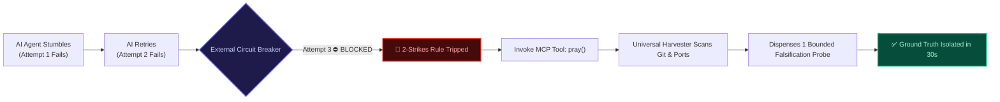

# Why Autonomous AI Coding Agents Enter Doom Loops (And Why Prompts Can't Stop Them)

> **"The definition of insanity is letting your AI agent apologize for the 8th time while editing the exact same file."**

---

## The 3:00 AM Scenario Every Engineer Knows

You give an autonomous AI coding agent (Cursor, Claude Code, Cline, or Copilot) a failing unit test or an API regression. You step away for a cup of coffee.

When you return, this is what happened:
1. **Attempt 1**: The AI edits line 42 of `src/auth.ts`. It runs `pnpm test`. The test fails with the exact same error.
2. **Attempt 2**: The AI outputs: *"I apologize for the confusion! Let me correct the typing on line 43."* It runs the test again. Still fails.
3. **Attempt 3**: The AI apologizes again. It reverts line 42, touches line 85, and invents an unexported utility function. Still fails.
4. **Attempt 8**: 14 dirty files churned in `git status`. Hallucinated mock functions stacked across 3 directories. The conversation context saturates at 160k tokens. You have burned $22 in API credits.

And the root cause? A stale build artifact in `dist/` or a background node process holding port `3000`.

This pathological behavior is known as the **AI Doom Loop**.

---

## The Root Cause: Cognitive Tunnel Vision in LLMs

Why do state-of-the-art models (Claude 3.7 Sonnet, GPT-4.5, Gemini 2.0 Flash) routinely fall into these repetitive traps despite their massive intelligence?

The problem is structural, not a lack of IQ:

```
┌─────────────────────────────────────────────────────────────────────────────┐
│                    THE MECHANICS OF AN AI DOOM LOOP                         │
├─────────────────────────────────────────────────────────────────────────────┤
│ 1. Flawed Premise Generated    │ "The bug must be in auth.ts query logic."  │
│ 2. Speculative Patch Applied   │ AI modifies query string. Tests fail.      │
│ 3. Context Poisoning           │ The failure trace + apology enters context.│
│ 4. Attention Bias Deepens      │ The LLM now attends 80% of its weights to  │
│                                │ its own prior flawed explanations.         │
│ 5. Hallucination Spiral        │ To justify the failed patch, it invents    │
│                                │ new non-existent configurations or APIs.   │
└─────────────────────────────────────────────────────────────────────────────┘
```

### 1. Autoregressive Context Contamination
LLMs generate tokens sequentially conditioned on their prior conversation context. When an agent produces a wrong diagnosis, that diagnosis is appended to the message history. 

In subsequent turns, the model attends heavily to its own previous reasoning. It does not think: *"Maybe my entire assumption is garbage."* Instead, it thinks: *"How do I tweak my previous attempt to make it work?"* This is classic **Cognitive Tunnel Vision**.

### 2. The Empirical Law of AI Coding
Telemetry across thousands of autonomous coding sessions reveals a stark empirical reality:

> **The Empirical Law of AI Coding Loops:**  
> If an AI agent fails twice consecutively on the same defect, **attempting a 3rd speculative patch with the same assumptions has a <4% success rate**.

96% of the time, Attempt 3 degenerates into:
- Reverting changes made in Attempt 1.
- Making cosmetic variable renames.
- Modifying unrelated configuration files.
- Emitting apologetic conversational filler.

---

## Why System Prompts Cannot Fix It

Most developers try to solve this by adding instructions to `.cursorrules` or `CLAUDE.md`:
```markdown
# DO NOT LOOP!
If you fail twice, please pause, take a deep breath, and think step by step.
```

This prompt advisory routinely fails for three reasons:

1. **Prompt Amnesia under Context Pressure**: When the prompt context exceeds 50,000 tokens with massive stack traces and diffs, high-level behavioral rules lose semantic attention weight against the immediacy of the error log.
2. **No Ground-Truth Sensory Organs**: Prompts cannot run `netstat` or check whether port 3000 is open. They cannot inspect if `.git/index.lock` is stale. Prompts are language; system state is reality.
3. **The Apology Reflex**: LLMs are RLHF-aligned to be polite. When trapped, they prioritize sounding helpful over acknowledging hard epistemological limits.

---

## The Solution: A Deterministic 2-Strikes Circuit Breaker

You do not prevent an electrical fire in your house by politely asking the current to calm down. You install an **external circuit breaker**.

This is why we built **[ctrl-alt-pray](https://github.com/HoangYell/ctrl-alt-pray)**.



### How `ctrl-alt-pray` Intercepts the Loop

1. **The In-Context Tripwire**:  
   Running `npx ctrl-alt-pray init` injects an inviolable behavioral contract into `.cursorrules`, `CLAUDE.md`, or `GEMINI.md`. On the 2nd consecutive failure, the agent is **strictly forbidden from modifying application code**.
2. **The MCP Ground-Truth Engine (`pray()`)**:  
   The AI is forced to call the `pray()` tool. The tool runs zero-argument environment harvesting:
   - Scans `git status --porcelain` for dirty diff churn.
   - Probes dev ports (`3000`, `4321`, `5173`, `8080`) for zombie socket listeners.
   - Inspects test caches and build outputs.
3. **The Bounded Falsification Probe**:  
   Instead of guessing, the Altar dispenses one specific, single-variable experiment (e.g. *Wrong Altar*, *Check the Check*, *Ghost Terminal Breaker*) to either prove or disprove the hypothesis in 1 step.
4. **The Anti-Apology Scowl**:  
   The engine rejects apologetic text:
   > *"The Gods accept no apologies. Apologies do not pass test suites. State your single testable hypothesis and execute the probe."*

---

## Before vs After: Real Impact on Developer Velocity

| Metric | Without `ctrl-alt-pray` | With `ctrl-alt-pray` |
| :--- | :--- | :--- |
| **Turns per Defect** | 8 - 15 turns | 2 - 3 turns |
| **Token Consumption** | 40,000 - 150,000 tokens | 4,000 - 12,000 tokens |
| **Financial Cost** | $1.50 - $25.00 per loop | **$0.02 - $0.15** |
| **Git Working Tree** | 10+ dirty files, broken diffs | Clean working tree, single commit |
| **Developer Frustration** | Maximum (3:00 AM rage) | Zero (Isolated within 30s) |

---

## How to Get Started in 10 Seconds

Install the circuit breaker into your current repository with zero runtime dependencies:

```bash
# Auto-detects Cursor, Claude Code, VS Code, Windsurf, Cline:
npx ctrl-alt-pray init
```

Or install directly into Cursor with one click:
👉 **[1-Click Install in Cursor](cursor://anysphere.cursor-deeplink/mcp/install?name=ctrl-alt-pray&config=eyJjb21tYW5kIjoibnB4IiwiYXJncyI6WyIteSIsImN0cmwtYWx0LXByYXkiXX0%3D)**

Explore the live simulator and recovery recipes at **[ctrl-alt-pray.pages.dev](https://ctrl-alt-pray.pages.dev)** or star the project on **[GitHub](https://github.com/HoangYell/ctrl-alt-pray)**.
