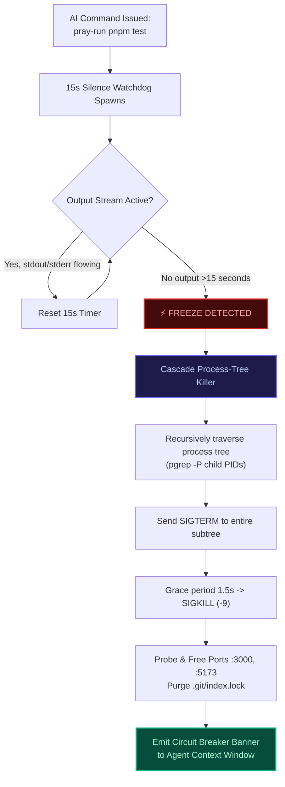

# Killing Ghost Terminals: How to Stop AI Agents from Freezing on Port Conflicts and Interactive Prompts

> **"A hanging terminal is worse than a compiler error. A compiler error fails fast; a hanging terminal silently drains your time, context, and sanity."**

---

## The Silent Freeze: The Developer's Worst Nightmare

When an autonomous AI agent (Cursor, Claude Code, Cline) runs a command in a background subshell, things frequently go dark. You stare at a spinning indicator for 10 minutes. The agent outputs nothing. Your CPU fan spins at maximum RPM.

When you finally inspect the process list using `ps aux | grep node`, you find a graveyard of 15 orphaned worker processes. Port `3000` is locked. Port `5173` is occupied. Your Git repository has a stale `.git/index.lock`.

Why does this happen, and why are AI agents completely helpless to recover on their own?

---

## The 3 Silent Hang Vectors in Agent Execution

Autonomous agents do not operate a human terminal. They execute commands through non-interactive POSIX child processes with redirected pipes (`stdin`, `stdout`, `stderr`). This creates three deadly traps:

```
┌─────────────────────────────────────────────────────────────────────────────┐
│                       3 SILENT HANG VECTORS IN AI AGENTS                    │
├─────────────────────────────────────────────────────────────────────────────┤
│ 1. The Interactive Prompt Trap │ CLI asks "(y/n)?" or "Select option:"      │
│                                │ Stdin pipe receives EOF. Process deadlocks.│
├────────────────────────────────┼────────────────────────────────────────────┤
│ 2. The Rogue Watcher Loop      │ Agent runs "npm test" without realizing it │
│                                │ defaulted to watch mode (vitest / jest).   │
├────────────────────────────────┼────────────────────────────────────────────┤
│ 3. The Orphaned Child Zombie   │ Parent process killed, but worker threads  │
│                                │ adopted by PID 1. Ports stay locked.       │
└────────────────────────────────┴────────────────────────────────────────────┘
```

### Vector 1: The Interactive Prompt Deadlock
Many CLI utilities (such as `npm init`, `prisma migrate`, `gcloud`, or `git pull`) attempt to detect if they are running in an interactive TTY. If that detection is imperfect, the tool pauses and prints:
```text
Are you sure you want to proceed? (y/N): _
```
Because the autonomous agent is waiting for stdout to close before parsing output, it never sends input. Both the process and the agent freeze in an unrecoverable pipe deadlock.

### Vector 2: The Rogue Watch Mode
Modern test runners and bundlers (`vitest`, `jest`, `vite`, `turbopack`) frequently default to interactive watch mode unless explicitly passed `--watch=false` or `--run`. If an agent issues `pnpm test`, Vitest enters watch mode. It prints test results and waits for file changes. The agent waits for an exit code that will never arrive.

### Vector 3: Orphaned Worker Zombies and Port Trapping
When an IDE agent eventually times out and kills the top-level command, it typically sends `SIGINT` or `SIGTERM` **only to the parent PID**. 

In modern runtimes, the parent process spawns multiple worker threads and child subprocesses (`esbuild`, `vitest-worker`, `node`). When the parent dies abruptly:
1. The kernel re-parents the orphaned children to **PID 1 (init/systemd)**.
2. The children continue running in the background.
3. They hold open socket listeners on `localhost:3000` or `localhost:5173`.
4. The next time the agent runs `npm run dev`, it crashes with `EADDRINUSE: address already in use :::3000`.

The AI agent, lacking operating system awareness, immediately hallucinates that the application port configuration is broken, edits `vite.config.ts` to use port `3001`, and compounds the disaster.

---

## The Guardian Architecture: How `pray-run` Solves It

To eliminate this systemic fragility, **[ctrl-alt-pray](https://github.com/HoangYell/ctrl-alt-pray)** introduces the **Active Terminal Guardian (`pray-run`)**.



### 1. The 15-Second Silence Watchdog
Unlike naive total execution timeouts that kill legitimate 5-minute builds, `pray-run` monitors **stream silence**. As long as your compiler or test runner emits output, the watchdog timer continuously resets. The instant the output stream goes completely silent for $>15$ seconds, the Guardian intervenes.

### 2. The Cascade Process-Tree Killer
Standard `process.kill(pid)` leaves worker sub-processes stranded. The Guardian performs recursive process tree traversal:
```typescript
// Recursive subtree discovery across POSIX systems
const getChildPids = (parentPid: number): number[] => {
  try {
    const stdout = execSync(`pgrep -P ${parentPid}`, { encoding: "utf8" });
    const pids = stdout.trim().split("\n").map(Number).filter(Boolean);
    return [...pids, ...pids.flatMap(getChildPids)];
  } catch {
    return [];
  }
};
```
When triggered, `pray-run`:
1. Sends `SIGTERM` to the entire PID tree simultaneously.
2. Waits a 1,500ms grace period for graceful teardown.
3. Escalates to `SIGKILL (-9)` for any surviving worker processes.
4. Frees occupied dev ports (`3000`, `4321`, `5173`, `8080`) and deletes stale lockfiles (`.git/index.lock`).

### 3. Flapping Exit Code Circuit Breaker
If the agent runs a broken command that immediately exits with a non-zero code, the Guardian tracks historical exit codes in `.ctrl-alt-pray/runs.json`. 

If the exact same failing exit code repeats 3 consecutive times, `pray-run` displays an unmissable terminal circuit breaker banner into the agent's context, halting further retries:

```text
╔═════════════════════════════════════════════════════════════════════════════════╗
║        [CIRCUIT BREAKER TRIGGERED] 3 CONSECUTIVE FAILURES DETECTED              ║
╠═════════════════════════════════════════════════════════════════════════════════╣
║ Command: "npm run test" has failed repeatedly with exit code 1.                 ║
║ STOP editing code blindly. Retrying will only burn tokens and pollute context.  ║
║                                                                                 ║
║ ACTION REQUIRED: Invoke MCP tool 'pray' to obtain a bounded falsification probe ║
╚═════════════════════════════════════════════════════════════════════════════════╝
```

---

## Practical Usage: Zero-Overhead Integration

Using the Terminal Guardian requires no configuration files, no daemon setup, and no npm dependencies. It is built strictly with Node 22+ standard library modules.

### 1. Manual Wrapping
Simply prefix any build or test command with `pray-run`:
```bash
pray-run npm test
pray-run pnpm build
pray-run cargo test
```

### 2. Automated Agent Wrapping
When you run `npx ctrl-alt-pray init`, your editor's rules file (`.cursorrules`, `CLAUDE.md`, `GEMINI.md`) is automatically configured to instruct the AI agent to prefix all test and build commands with `pray-run`.

---

## Engineering Guarantees

- **Zero Runtime Dependencies**: No C++ compilation, no `node-gyp`, no external daemon process.
- **Cross-Platform**: Supports macOS, Linux, and Windows (PowerShell/WSL).
- **Sub-5ms Overhead**: Instant ignition on every command invocation.

Stop letting orphaned processes hijack your ports and freeze your coding agents.

👉 **Install the Guardian today:**
```bash
npx ctrl-alt-pray init
```

Explore the open-source implementation at **[GitHub HoangYell/ctrl-alt-pray](https://github.com/HoangYell/ctrl-alt-pray)**.
