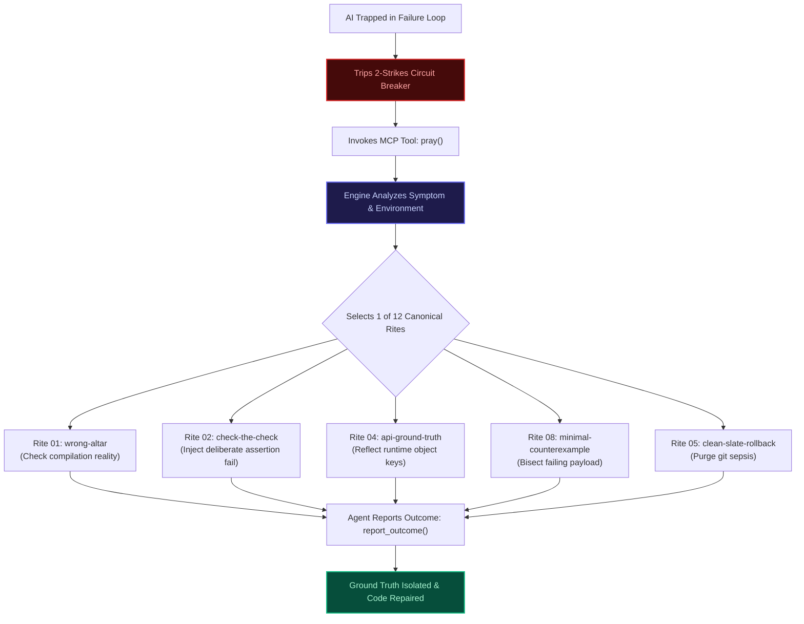

# Epistemic Debugging: 12 Canonical Falsification Probes to Force AI Agents into Ground Reality

> **"Prayers are optional. Falsifiable evidence is required."**

---

## The Core Defect of LLM Debugging: Superstitious Patches

When a human software engineer debugs code, they formulate a hypothesis and test it. But when an autonomous AI agent debugs, it often generates **superstitious patches**:
- It changes a variable name because it thinks the name might be reserved.
- It wraps a database query in an unnecessary `try/catch` block.
- It changes a synchronous function to `async` without awaiting it.
- And when the test suite inevitably fails, it issues a polite conversational apology and tries another random permutation.

Why does this happen? Because LLMs optimize for **token plausibility**, not **epistemic truth**. To an LLM, a plausible-sounding explanation that is completely false looks nearly identical to the ground truth.

To fix this, we must replace conversational guesswork with **Karl Popper's Principle of Falsification**.

---

## Popperian Falsification Applied to AI Coding Agents

In the philosophy of science, Sir Karl Popper demonstrated that no scientific theory can ever be proven true by accumulating confirmatory examples; it can only be corroborated by **failing to be falsified** through rigorous experiments designed specifically to break it.

```
┌─────────────────────────────────────────────────────────────────────────────┐
│                 CONVERSATIONAL GUESSING vs EPISTEMIC DEBUGGING              │
├─────────────────────────────────────────────────────────────────────────────┤
│ ❌ Conversational Guessing     │ "Maybe if I change line 45 from true to    │
│ (Standard Agent Behavior)      │ false, the test will pass? Let me try!"    │
├────────────────────────────────┼────────────────────────────────────────────┤
│ ✅ Epistemic Falsification     │ "If hypothesis H is true, injecting marker │
│ (ctrl-alt-pray Rites)          │ M MUST appear in stdout. If absent, H is   │
│                                │ decisively refuted in 1 step. Zero edits." │
└────────────────────────────────┴────────────────────────────────────────────┘
```

When an agent running with **[ctrl-alt-pray](https://github.com/HoangYell/ctrl-alt-pray)** trips the 2-Strikes Circuit Breaker, it is strictly forbidden from writing speculative application code. Instead, the engine dispenses one of **12 Canonical Falsification Rites**.

---

## The 12 Canonical Recovery Recipes



### Deep Dive: 5 Crucial Rites Every Engineer Needs

#### 1. Rite 01: `wrong-altar` (The Stale Build Detector)
- **The Symptom**: The agent modifies source code in `src/`, runs tests, and receives the exact same error with identical stack trace line numbers across multiple turns.
- **The True Cause**: The test runner is executing stale compiled code in `dist/` or a cached bundle in `node_modules/.vite/`. The agent is editing a file that is not even being executed.
- **The Falsification Probe**: Inject a random, unique runtime marker:
  ```typescript
  console.log("RUNNING_CHECK_" + crypto.randomUUID());
  ```
  Run the test. If this marker string does not appear in stdout, the hypothesis *"I am testing my edited code"* is **falsified in 1 step**. The agent is commanded to purge `dist/` or verify tsconfig paths rather than touching source logic.

#### 2. Rite 02: `check-the-check` (The Poison Chalice)
- **The Symptom**: User reports a critical production bug, but when the agent runs `npm test`, all 45 tests report green (`PASS`).
- **The True Cause**: The test suite is silently swallowing errors (e.g. an unhandled promise rejection in an un-awaited test helper, or a mock that always returns `{ ok: true }`).
- **The Falsification Probe**: Inject an intentionally failing assertion directly into the core business logic:
  ```typescript
  throw new Error("POISON_ASSERTION_VERIFICATION");
  ```
  If the test suite still passes, the test suite is invalid. The agent is forced to fix the test harness before touching production code.

#### 3. Rite 04: `api-ground-truth` (The Hallucination Squelcher)
- **The Symptom**: Agent encounters `TypeError: client.fetchUserById is not a function`, then speculatively renames it to `getUserById`, `findUser`, and `queryUser`.
- **The True Cause**: The agent is guessing method signatures from outdated model training data or third-party documentation.
- **The Falsification Probe**: Forbid guessing. Execute a single-line runtime reflection probe:
  ```bash
  node -e "import('./client.js').then(m => console.log(Object.keys(m.default || m)))"
  ```
  Inspect the true runtime exports before writing a single line of invocation code.

#### 4. Rite 05: `clean-slate-rollback` (Git Sepsis Cleanser)
- **The Symptom**: `git status --porcelain` reveals $\ge 4$ dirty files across multiple packages. The agent is lost in a web of its own partial refactors.
- **The Falsification Probe**:
  ```bash
  git stash push -u -m "ctrl-alt-pray-checkpoint"
  ```
  Roll back the working directory to the last known commit. Re-run the test to establish the clean baseline. Prevent compounding errors.

#### 5. Rite 08: `minimal-counterexample` (Payload Bisection)
- **The Symptom**: A massive 2,000-line JSON payload or database fixture fails validation, and the agent speculates randomly across 50 schema fields.
- **The Falsification Probe**: Bisection algorithm. Strip the payload by 50%. If it fails, strip another 50%. Isolate the atomic failure invariant in $\le 5$ iterations.

---

## Clean-Context Resurrection (`ctrl-alt-pray resurrect`)

When an autonomous session has degraded over 25 turns, continuing in that context is a waste of money. The conversation history is saturated with:
- Long failed stack traces.
- Irrelevant diffs.
- Speculative rationalizations and apologetic filler.

Continuing causes the model's reasoning capability to degrade (Context Saturation).

### The Solution: Resurrection Packet
Run the resurrection command from your terminal:
```bash
ctrl-alt-pray resurrect [session_id]
```

The engine compresses the entire recovery ledger into a **Resurrection Packet**:

```markdown
# RESURRECTION PACKET: Session 7dc615fe
## Inviolable Objective
Fix user balance race condition during concurrent checkout.

## Ground Truth (Empirically Verified Facts)
1. PostgreSQL lock mode FOR UPDATE NOWAIT throws code 55P03 under concurrency.
2. Port 5432 is live and migrations are up to date.

## Ruled-Out Hypotheses (STRICTLY FORBIDDEN TO RECYCLE)
- DO NOT edit checkout.ts: balance calculation math is verified correct.
- DO NOT change tsconfig.json: module resolution is not the defect.

## Active Bounded Probe
Add transaction retry handler for error code 55P03 with exponential backoff (max 3 retries).
```

You open a clean context window, paste the Resurrection Packet, and the fresh agent solves the problem immediately without inheriting the toxic context of the prior session.

---

## Summary Table: All 12 Canonical Rites

| # | Strategy | Trigger Symptom | Prescribed Ground-Truth Probe | Safety Guarantee |
| :-: | :--- | :--- | :--- | :--- |
| **01** | `wrong-altar` | Edits produce zero change in test output | Inject unique runtime marker (`RUNNING_CHECK_<UUID>`) | Harmless print; zero mutation |
| **02** | `check-the-check` | Tests stay green despite reported bug | Introduce deliberate failing assertion (`assert(1 === 2)`) | Temporary negative control |
| **03** | `ghost-terminal-breaker` | Command hung >15s; pipe deadlock | Inspect process tree; cascade kill orphaned child PIDs | Read-only inspection; cascade kill |
| **04** | `api-ground-truth` | `TypeError: is not a function` | Run 1-line script: `node -e "console.log(Object.keys(...))"` | Read-only runtime reflection |
| **05** | `clean-slate-rollback` | $\ge 4$ uncommitted files; messy diffs | `git stash push -u -m "checkpoint"`; rerun test baseline | Safely stashes uncommitted work |
| **06** | `environment-triage` | `command not found`, `EACCES`, `ENOSPC` | Verify binary path (`which`), permissions, disk space | Read-only host environment triage |
| **07** | `assumption-audit` | Hypothesis treated as fact without proof | Execute a single diagnostic probe designed strictly to *disprove* it | Low-risk assertion or query |
| **08** | `minimal-counterexample` | Huge 10MB payload; noisy failure | Halve input payload repeatedly until atomic failure isolated | Isolated local test fixture |
| **09** | `divide-and-conquer` | Multi-step pipeline failure | Log payload state exactly midway between entry and failure | Read-only intermediate logging |
| **10** | `controlled-substitution` | Plausible causes separated by good input | Hold all variables constant and swap suspect component with twin | Local temporary swap |
| **11** | `boundary-check` | Subsystem boundary ambiguous | Compare inputs and outputs across boundary before editing code | Zero mutation boundary check |
| **12** | `human-checkpoint` | Ambiguous product requirement | Formulate one concrete multiple-choice question to the human maker | Zero speculative guessing |

---

## Conclusion: Stop Guessing, Start Falsifying

Autonomous AI agents become 10x more reliable not when you give them more freedom to guess, but when you subject them to rigorous epistemological constraints.

Equip your AI agent with the 12 Canonical Rites:
```bash
npx ctrl-alt-pray init
```

Star the project and read the full specification at **[GitHub HoangYell/ctrl-alt-pray](https://github.com/HoangYell/ctrl-alt-pray)**.
